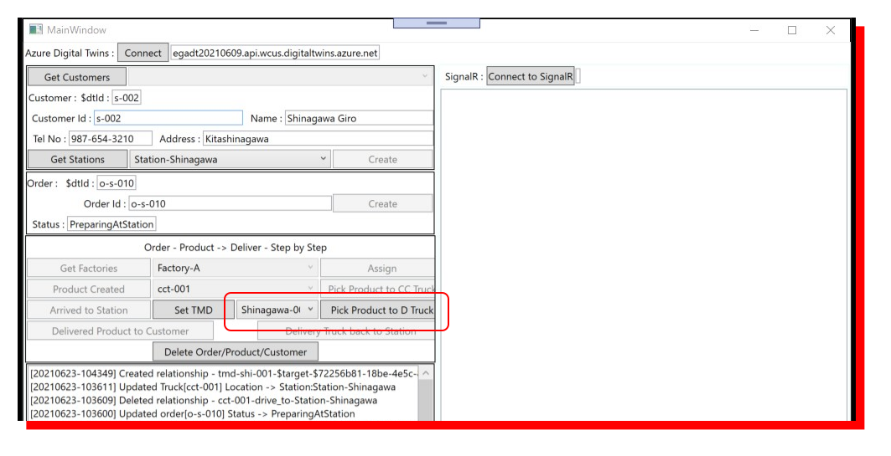
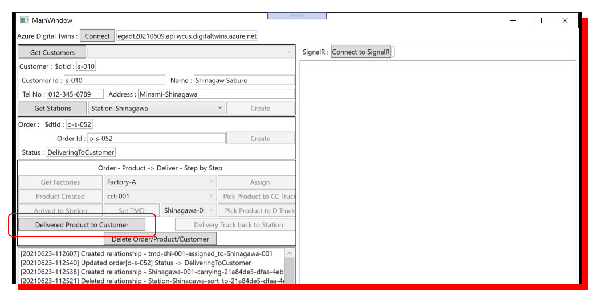
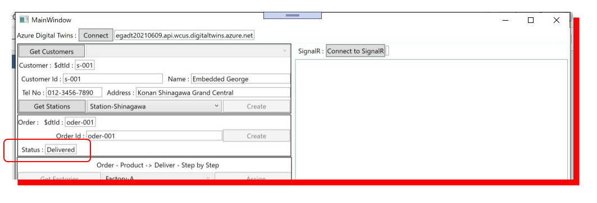
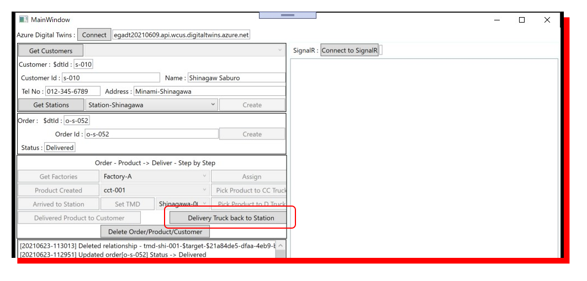
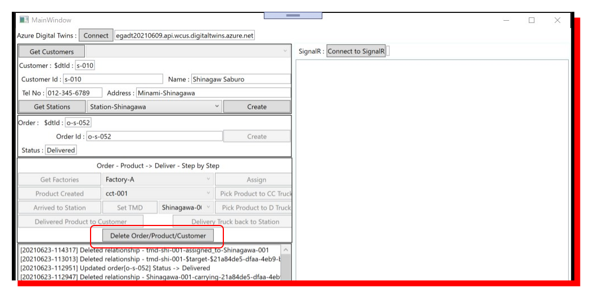

# How to use WpfAppProductTransportSample app  
本チュートリアルで紹介しているシナリオを 実際の Twin Graph を使って試してみるためのツール  
## Setup  
### Azure Digital Twins Instance 作成  
まず、https://docs.microsoft.com/ja-jp/azure/digital-twins/quickstart-azure-digital-twins-explorer#set-up-an-azure-digital-twins-instance の説明に従って、Azure Digital Twins Instane を作成する。  

### Twin Model のアップロード
次に、Azure Portal で、作成したインスタンスのページから、Azure Digital Twins Explorer を開き、[models](/models) に格納されている JSON で記述された、DTDL ファイルを全てアップロードする。  
[model_icons](/model_icons)に、Twin Class それぞれのアイコン用画像があるので、そちらもアップロードしておくと便利である。  

### 初期モデルの設定  
WPF アプリで操作する Twin Graph のベースを作成する。  
Station、Factory、Cooling Container Truck、Delivery Truck の Twin を2個ほど作成し、Station と Delivery Truck の assign_to の Relationship を作成する。  
  

### WpfAppProductTransportSample アプリの設定  
Visual Studio 2019 で、[samples/wpfapp/WpfAppProductTransportSample](.)の WpfAppProductTransportSample.sln を開く。  
[appsettings.json](WpfAppProductTransportSample/appsettings.json) を開き、Azure Digital Twins インスタンスの URL を設定する。  

以上で、実行用の設定は完了。  

※ 本アプリは、WPF .NET Core で開発されているので、VS Code でも設定・実行は可能。  

---
## アプリ実行による Twin Graph の操作  
本アプリは、以下の一連の流れをシミュレーションする。  
- Customer の作成  
- Customer に紐づけて Order を作成  
- Order に対する Product 生産する Factory の割り当て  
- Factory での Product 生産完了  
- Product の Cooling Container Truck への積み込みと Station への輸送  
- Station への到着と、Station への運び込み  
- 配送準備の完了と Delivery Truck への積み込み  
- Customer への配送  

アプリの実行中、Azure Digital Twins Explorer で Twin Graph の変化を見ながら進めるとよい。  

### 0. Azure Digital Twins インスタンスへの接続  
左上の "Connect" をクリック。  
  

### Customer の生成  
製品発注者の Customer を作成する。  
"Customer Id"、"Name"、"Tel No"、"Address" に適当な文字列を入力する。  
"Get Stations" をクリックすると、右横のコンボボックスに Twin Graph に存在する Station が入るので、そこから一つ選択して、"Create" をクリックする。  
  
"$dtId"には、"Customer Id" に入力した文字列を、Twin の $dtId に格納可能な形式に変換された値が表示される。  
Azure Digital Twins Explorer で、"Run Query"をクリックして表示を更新すると、作成した Customer Twin が表示される。  
※ 2021/6/16 時点では、本来表示されるはずの Customer と Station 間の Relationship が表示されない（バグか？）  

### 1. Order の作成  
作成した Customer に紐づけて、Order を作成する。  
"Order Id" に適当な文字列を入力し、"Create" をクリックする。  

"Status" は、以降の操作に従って、注文の状態が自動的に変更されていく。  

### 2. Factory の選択と割り当て  
作成された Order に対する Factory を割り当てる。  
"Get Factory" をクリックすると、現在 Twin Graph 上に存在している Factory Twin を検索して、右隣のコンボボックスにリストアップされる。コンボボックスから、Factory Twin を選択する。  
  
Factory を選択すると、"Assign" が Enable になるので、クリックする。  
Order の Status が更新され、Twin Graph は、Order と Factory の間に、is_assigned_for の Relationship が作成される。  

### 3. Product の生産完了と Cooling Container Truck のリストアップ  
"Product Created" をクリックして、Product の Twin を作成する。前段で選択した Factory が生産されたことを示すために、Factory と Product 間で、created_at の Relationship が作成される。  
  
Order された Product の生産が完了したので、それを Station に輸送する Cooling Container Truck を Twin Graph からリストアップし、右横のコンボボックスに追加する。  

### 4. ステーションへの配送用の Cooling Container Truck の選択と積み込み  
コンボボックスから Cooling Container Truck を選択し、"Pick Product to CC Truck" をクリックする。  
  
この操作で、Truck と Product の間に、"carrying" という Relationship が作成され、更に、Product → Order → Customer → Station と Relationship を辿って、Cooling Container Truck の行き先が確定し、Truck と Station の間で、"drive_to" という Relationship が作成される。  

### 5. Cooling Container Truck の Station への到着  
"Arrive to Station" をクリックすると、drive_to で示された、目的地に Truck が到着した状態になる。  
  
到着したので、Station に Product が運び込まれる。この際、到着した Cooling Container Truck に carrying で関連付けられている Product 群の中で、届け先の Customer を担当する Station が、到着している Station と同一の Product も Station に運び込まれる。  
運び込まれた Product Twin は、Cooling Container Truck と結ばれた carrying が削除され、Station と sort_to という Relationship が新たに作成される。  
他に、Cooling Container Truck は、既に Station に到着済みなので、drive_to という Relationship は削除される。  
次のステップとして、Station 内で配送処理された後の Product を Customer にお届けする Delivery Truck が必要になるので、Twin Graph から当該 Station に関連付けられた Delivery Truck をリストアップして、右横のコンボボックスに格納する。  

### 6. 配送準備の完了と Delivery Truck への Product の積み込み  
配送準備とは、Twin Graph の表現に置き換えると、  
- Station に備え付けられた Temperature Measurement Device（以下 TMD と略す）を Product に割り付ける⇒ Station に 'equipments' で関連付けられた TMD でかつ、Delivery Truck に 'assigned_to' で関連付けられていない TMD と Product 間を 'target' で関連付ける  

※ Delivery Truck と 'assigned_to' と関連を持ち、かつ、Product と "target" と関連を持っている TMD は、TMD が装備された Product が Delivery Truck に載せられて搬送状態であることを意味し、前者のみの関連を持っている場合は、Customer への Product の配送が完了（その時点で TMD は回収されるはず）し、Delivery Truck で Station に戻される途中であることを意味する。  
ということで、以上のことをまず実行する。  
※ ここまで特に TMD の Twin については何も言及していなかったので、念のため。上記の操作をするためには、当然、TMD の Twin と Station との Relationship が Twin Graph 上に存在していなければならない。下図を参考に各自の Twin Graph に必要な Twin と Relationship を作成すること。  
  

"Set TMD" をクリックし、上記の、TMD の選択と Product との Relationship を作成する。  

これで配送準備が整ったので、コンボボックスで、Customer への配送で利用する Delivery Truck を選択し、右横の"Pick Product to Deliver Truck"をクリックする。  
  
この操作で、Product と Station の間で結ばれていた sort_to は削除され、Product と Truck の間で、carrying という Relationship が作成される。  

### 7. Customer への配達完了  
"Deliverd Product to Customer" をクリックして、Customer に Product をお届け完了とする。  
  
これで、配送は完了。  
Order の Status が、Delivered に変わり、Delivery Truck と Product 間の carrying が削除される。  
  

### 8. Station への Delivery Truck の帰還  
配達終了後（リアルなシナリオなら、他の Customer に届ける荷物も積んであるはずで、それら全て配達作業が一段落したらだろうけど）、Station に戻って、TMD を回収する。  
"Delivery Truck back to Station" をクリックする。  
  
Delivery Truck が Station に戻ったので、TMD を回収する。  
つまり、TMD と Delivery Truck の間の "assigned_to" を削除する。  

### 9. Product、Order、Customer の削除  
前ステップが完了した時点で、Order、Product、Customer の Twin はまだ Twin Graph 上に残っている。  
これをそのまま残すか、削除するかは、開発するソリューションがどうしたいかによる。  
そのまま履歴として保持しておくのであれば、そのまま残せばよいし、履歴は、Cosmos DB や RDB で保持するのであれば、削除してかまわない。  
本アプリでは、一連のステップのお試しが終わってもうすべて削除するために、"Delite Order/Product/Customer" を用意している。削除したい場合はこのボタンをクリックする。  
  
Customer については、削除するかどうか聞いてくるので、再度、注文から配達までを同じ Customer で試したい場合は削除せず、そうでない場合は削除で実行する。  
また、Customer 削除を選択したとき、更に、Twin Graph 上の全ての Order、Product、Customer の削除も選択可能である。  
Twin の削除の際、関係している Relationship を全て削除する。  

---
## Signal R を利用した、Product の今を表示  
[HowToBuildWPFApp.md](../../../tutorial/HowToBuildWPFApp.md#signalr-を利用したtwin-情報更新通知の受信) の説明を参照の事。  
