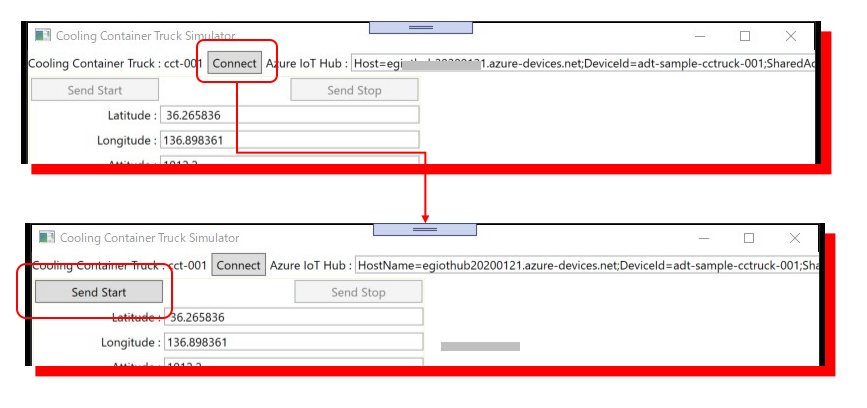

# Simulator Application for Cooling Container Truck and Delivery Truck  
このハンズオンに沿った形で、Azure IoT Hub → Azure Digital Twins に、運送用トラックの庫内温度、位置情報、及び、配送用トラックの位置情報と積載された温度計測機器からの温度情報を送付するシミュレーターをサンプルとして紹介する。  

## アプリ開発にあたっての基本方針  
IoT Hub に登録されたデバイスと、Azure Digital Twins の Twin Graph との紐づけは、Cooling Container Truck と Delivery Truck の "iothub_deviceid" プロパティに、IoT Hub に登録された対応するデバイスの DeviceId を保持することによって行うものとする。  
本コンテンツ作成過程において、IoT Hub 側に登録されたデバイスの Tag に、Twin の $dtId の値を格納しようと考えたが、  
- どちらがより変化しやすいか  
- IoT Hub に登録されたデバイスが送信するデータは、他のソリューションでも利用される可能性がある  
この2点から、Twin Graph 側で保持することとした。  


---
## サンプルアプリの基本機能  
サンプルアプリは以下の機能を有する。  
- Twin Graph 上の、Cooling Container Truck、Delivery Truck の情報を収集し、リスト表示  
- リストされた中から、シミュレーションする Twin を選択  
- 選択された Twin のプロパティ情報を元に、IoT Hub に登録された対応するデバイスの接続情報を取得  
- Cooling Container Truck の場合は、指定された時間間隔で、位置情報を IoT Hub に送信  
- Delivery Truck の場合は、トラックの位置情報、状態を、Twin Graph 上で搭載された製品に装備された温度計測機器群（Twin Model の定義から製品は複数搭載されているので、温度計測機器も複数ある）のそれぞれの温度、バッテリーレベル、計測時間を IoT Hub に送信  

---
## 準備  
本シミュレーターアプリを使うにあたり、以下の二つの作業を行う。  
- IoT Hub に、Twin Graph 上で定義された、Cooling Container Truck、Delivery Truck に対応するデバイスを登録する  
- Twin Graph 上の、Cooling Container Truck、Delivery Truck の Twin の "iothub_deviceid" プロパティに対応する IoT Hub 上の DeviceId をセットする  

### IoT Hub へのデバイス登録
https://docs.microsoft.com/ja-jp/azure/iot-hub/quickstart-control-device-dotnet#create-an-iot-hub の説明を参考に、Azure IoT Hub インスタンスを作成する。  

作成した Azure IoT Hub インスタンスを、https://portal.azure.com で開き、以下の様に、"IoT devices" を選択し、"+New" をクリックし、予め決めておいた Device Id を入力して、"Save" をクリックして作成する。  
  

例えば、Twin Graph が図の様な状態であれば、  
  
Cooling Container Truck が2つ、Delivery Truck が2つあるので、以下の様に対応する4つの IoT Device を IoT Hub に登録する。
※ 文字列はあくまでも例なのでこの通りでなくてよい  
|Twin Graph|Type|IoT Hub|
|-|-|-|
|cct-001|Cooling Container Truck|adt-sample-cctruck-001|
|cct-002|Cooling Container Truck|adt-sample-cctruck-002|
|Shinagawa-001|Delivery Truck|adt-sample-dtruck-001|
|Ueno-001|Delivery Truck|adt-sample-dtruck-002|

次に、登録した Device Id を、Twin Graph 側の Twin のプロパティにセットする。  

  

---
### Application への接続・認証情報設定  
Visual Studio 2019 で、[WpfAppTruckSimlator.csproj](./WpfAppTruckSimulator.csproj) を開き、 [appsettings.json](./appsettings.json) を編集する。  
```json
{
  "iothub-connetion-string": "<- IoT Hub Connection String - registry Read ->",
  "adt-instance-url": "<- your Azure Digital Twins Instance URL ->"
}
```  
<b><i>&lt;- IoT Hub Connection String - registry Read -&gt;</i></b> の部分は、以下の図に従って、Azure Portal で Azure IoT Hub の接続ポリシー情報から取得した文字列で置き換える。  

  
※ 本アプリケーションでは、Twin Graph の情報から取得した、IoT Hub の IoT device の登録情報を取得するので、 Registry Read 権限が必要。  

<b><i>&lt;- your Azure Digital Twins Instance URL -&gt;</i></b> の部分は、Azure Digital Twins の URL で置き換える。  

---
## Application の実行  
Visual Studio で Debug 実行する。  
appsettings.json に記載した接続情報がセットされた状態でウィンドウが開く。  
図の様に、2つの "Connect" ボタンを順にクリックして、作業を開始する。  
  

### Cooling Container Truck の Simulation
"Get CC Trucks" をクリックすると、Azure Digital Twins の Twin Graph から Cooling Container Truck の Twin がリストアップされ、表示される。  
  

表示された Cooling Container Truck から Simulation したいものを選択し、"Start Simulation" をクリックすると、Simulation 用のウインドウが表示される。  
  
この際、IoT Hub のデバイスレジストリから、Cooling Container Truck の "iothub_deviceid" に保持された Device Id の接続情報を取得する。  

"Connect" をクリックすると、Azure IoT Hub に、選択した Cooling Container Truck に対応するデバイスとして接続が完了する。  
  
"Send Start"ボタンが有効になるのでクリックするとメッセージ送信が開始される。   
  

送信中に、Latitude、Longitude 等の値を変えると、変更された値が IoT Hub に送信される。  
※ 将来的にはこのウィンドウの右側で地図表示して、位置を変えられるようにする予定

"Send Stop" をクリックすると、送信が停止する。  

### Delivery Truck と Temperature Measurement Device の Simulation  
"Get Deliver Trucks をクリックすると、Azure Digital Twins の Twin Graph から Delivery Truck の Twin がリストアップされ、表示される。  
  

表示された Delivery Truck から Simulation したいものを選択し、"Start Simulation" をクリックすると、Simulation 用のウインドウが表示される。  
  
この際、選択した Delivery Truck の "iothub_deviceid" プロパティを元に、IoT Hub の Device Registry から対応する IoT Device の接続情報を取得し、更に、Azure Digital Twins の Twin Graph から選択された Delivery Truck に、"assigned_to" で関連付けられた Temperature Measurement Device を収集する。

図では、二つの TMD が表示されている。これは、Azure Digital Twins の Twin Graph が以下の様な状態で実行しているからである。  
  
選択した Delivery Truck には、2つの TMD が関連付けられているので、このような結果になる。  

"Connect" をクリックすると、IoT Hub に接続が行われ、"Send Start" をクリックすると、Delivery Truck の位置、状態、TMDの温度、バッテリーレベルが送信される。  
  

（ちょっと凝りすぎ？）シナリオ的に、Delivery Truck で製品を運ぶときは、クーラーボックスに製品を入れて配送するとなっているので、当然段々と温度は上昇するよなと、更に、TMD の電池もデータを送信するたびに減るよな、ということで、値の変化も気持ちシミュレーションしている。  

### Delivery Truck の位置情報を地図で表示・指定する  
Delivery Truck の位置情報を、Azure Maps で表示・指示する機能を追加する。  
Azure Maps の利用方法は、https://docs.microsoft.com/ja-jp/azure/azure-maps/about-azure-maps を参照の事。  
この WPF アプリでは、WebView という UI 部品を使って、HTML ファイルを表示・アプリロジックとの相互通信を行うことにより、Azure Maps の機能を利用する。  

#### Azure Maps アカウント作成  
https://docs.microsoft.com/ja-jp/azure/azure-maps/quick-demo-map-app#create-an-azure-maps-account を参考にしてアカウントを作成し、<b>Client ID</b> と<b>共有キー</b>を準備する。  

#### WPF アプリへの Azure Map Web アプリの組込み  
このプロジェクトに、NuGet パッケージの "Microsoft.Web.WebView2" をインストールする。  
WebView2 を XAML ファイルに組み込む。  
```xml
<Window x:Class="WpfAppTruckSimulator..."
        xmlns:local="clr-namespace:WpfAppTruckSimulator"
        xmlns:wv2="clr-namespace:Microsoft.Web.WebView2.Wpf;assembly=Microsoft.Web.WebView2.Wpf"
        mc:Ignorable="d"
        Title="..." Height="450" Width="800">
    <Grid>
        ...
            <Border BorderBrush="Beige" Grid.Column="1" BorderThickness="1" Margin="1">
                <wv2:WebView2 Name="webView"/>
            </Border>
        </Grid>
    </Grid>
</Window>
```

プロジェクトに、<b>map</b> という名前でフォルダーを作成し、更にその下に、<b>scripts</b>という名前でフォルダーを作成する。  
  
https://github.com/Azure-Samples/AzureMapsCodeSamples で多くの Azure Map Web アプリサンプルが公開されていて、かつ、便利なライブラリも用意されているので、この Github リポジトリを clone し、AzureMapsCodeSamples/Common/scripts/ の JS ファイルを丸ごと Visual Studio 2019 のプロジェクトの、作成した map/scripts にコピー＆ペーストする。  
図の様に、ファイルエクスプローラーで clone したフォルダーを開き、項目を全部選択（Ctrl+A）して、Visual Studio の Solution Explorer の map/scripts フォルダーにドラッグ＆ドロップするとよい。  
  

ライブラリを追加した状態を以下に示す。
  

ドラッグ＆ドロップしたファイルは全て、"出力ディレクトリにコピー" の項目を "新しい場合はコピーする" に設定変更する。  
  

次に、map フォルダーの直下に、index.html というファイル名で HTML ファイルを追加する。  
内容は、以下の通り  
```html
<!DOCTYPE html>
<html lang="en" xmlns="http://www.w3.org/1999/xhtml">
<head>
    <meta charset="utf-8" />
    <meta name="viewport" content="width=device-width, initial-scale=1, shrink-to-fit=no">
    <meta name="keywords" content="Microsoft maps, map, gis, API, SDK, animation, animate, animations, point, symbol, pushpin, marker, pin" />
    <meta name="author" content="Microsoft Azure Maps" />

    <!-- Add references to the Azure Maps Map control JavaScript and CSS files. -->
    <link rel="stylesheet" href="https://atlas.microsoft.com/sdk/javascript/mapcontrol/2/atlas.min.css" type="text/css">
    <script src="https://atlas.microsoft.com/sdk/javascript/mapcontrol/2/atlas.min.js"></script>
    <!-- Add reference to the animation module. -->
    <script src="./scripts/azure-maps-animations.min.js"></script>
    <!-- Add a reference to the Azure Maps Services Module JavaScript file. -->
    <script src="https://atlas.microsoft.com/sdk/javascript/service/2/atlas-service.min.js"></script>
    <title></title>
    <script type="text/javascript">
        function setup(event) {
            chrome.webview.addEventListener('message', args => {
                receiveMessage(args);
            });
            CreateMap();
        }
        function receiveMessage(msg) {
            var receiveMsg = JSON.parse(msg.data);
            if (receiveMsg.msgtype == 'map') {
                CreateMap(receiveMsg.clientId, receiveMsg.key);
            }
            if (receiveMsg.msgtype == 'position') {
                var position = receiveMsg;
                atlas.animations.setCoordinates(marker, [position.longitude, position.latitude], { duration: 1000, easing: 'easeInElastic', autoPlay: true });
                map.setCamera({ center: [position.longitude, position.latitude] });
            }
        }
        function sendMessage(msg) {
            window.chrome.webview.postMessage(JSON.stringify(msg));
        }

        var map, marker;

        function CreateMap() {
            //Add Map Control JavaScript code here.
            //Instantiate a map object
            map = new atlas.Map("myMap", {
                //Add your Azure Maps subscription key to the map SDK. Get an Azure Maps key at https://azure.com/maps
                center: [-121.69281, 47.019588],
                zoom: 10,
                view: 'Auto',
                authOptions: {
                    authType: 'subscriptionKey',
                    clientId: "Azure Map Account - Client ID", //Your Azure Active Directory client id for accessing your Azure Maps account.
                    subscriptionKey: "Azure Map Account - Key"
                }
            });
            //Wait until the map resources are ready.

            map.events.add('ready', function () {
                //Add the zoom control to the map.
                map.controls.add(new atlas.control.ZoomControl(), {
                    position: 'top-right'
                });

                //Create a marker and add it to the map.
                marker = new atlas.HtmlMarker({
                    position: [-121.69281, 47.019588]
                });
                map.markers.add(marker);

                //When the map is clicked, animate the marker to the new position.
                map.events.add('click', function (e) {
                    atlas.animations.setCoordinates(marker, e.position, { duration: 1000, easing: 'easeInElastic', autoPlay: true });
                    sendMessage({ msgtype: 'position', latitude: e.position[1], longitude: e.position[0] });
                });
            });
        }
    </script>
    <style>
        html,
        body {
            width: 100%;
            height: 100%;
            padding: 0;
            margin: 0;
        }

        #myMap {
            width: 100%;
            height: 100%;
        }
    </style>
</head>
<body onload="setup()">
    <div id="myMap"></div>
</body>
</html>
```
<b>clientId: "Azure Map Account - Client ID"</b> と、<b>subscriptionKey: "Azure Map Account - Key"</b> の " で囲まれた文字列を Azure Maps アカウントの Client ID、共有 Key で置き換える。  
index.html ファイルの "出力ディレクトリへのコピー" も "新しい場合はコピー" を選択する。  
index.html ファイルには、WPF アプリのロジック側から、緯度経度を受信してその場所を表示する機能と、マップ上でマウスクリックで指定された位置の緯度経度を WPF アプリのロジックに送信する機能を備えている。  

XAML ファイルのコードビハインドで、Window が表示された時点で呼ばれるコールバック（Loaded）に、以下のコードを追加する。  
```cs
            await webView.EnsureCoreWebView2Async(null);
            var currentDirectory = Environment.CurrentDirectory;
            var indexFileUri = new Uri($"{currentDirectory}/map/index.html");
            webView.CoreWebView2.Navigate(indexFileUri.AbsoluteUri);
            webView.WebMessageReceived += WebView_WebMessageReceived;
```
このコードで、map/index.html が読み込まれて地図が表示される。  
```cs
        private void SetPositionToWebView(double latitude, double longitude)
        {
            var msg = new
            {
                msgtype = "position",
                latitude = latitude,
                longitude = longitude
            };
            webView.CoreWebView2.PostWebMessageAsString(Newtonsoft.Json.JsonConvert.SerializeObject(msg));
        }

        private void WebView_WebMessageReceived(object sender, Microsoft.Web.WebView2.Core.CoreWebView2WebMessageReceivedEventArgs e)
        {
            Dispatcher.Invoke(() =>
            {
                dynamic msg = Newtonsoft.Json.JsonConvert.DeserializeObject(e.TryGetWebMessageAsString());
                if (msg.msgtype == "position")
                {
                    tbLatitude.Text = $"{msg.latitude}";
                    tbLongitude.Text = $"{msg.longitude}";
                }
            });
        }
```
上の二つのメソッドを実装することにより、ロジックから SetPositionToWebView をコールすれば、index.html 上の地図のマーカーが移動するし、マーカーの位置を中心に地図が表示される。  
index.html の地図上でマウスでクリックすれば、 WebView＿WebMessageReceived がコールされ、緯度経度が取得できる。  

以上で、地図の組込み例は完了。  

ここで紹介した方法と SignalR による位置情報更新通知を組合わせれば、複数のトラックの現在位置を逐次表示する様なアプリも開発可能である。  

---

参考までに送信データを下図に示す。  

