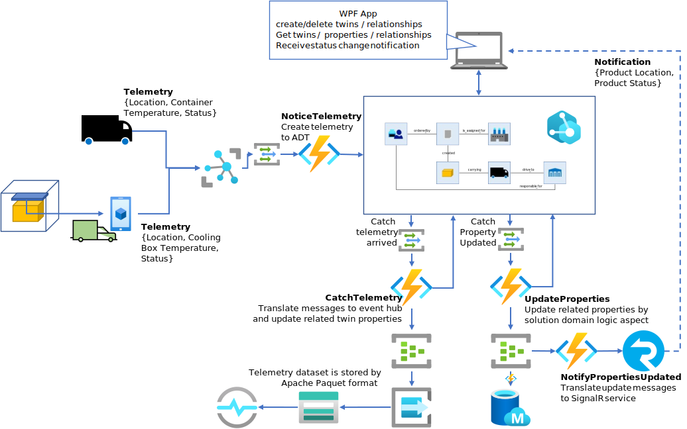

# Azure Digital Twins を利用した、アプリケーション開発  
開発するソリューションが扱う概念群の今の状態（Twin Graph）を保持するのが Azure Digital Twins であり、Twin・Relationship の生成・削除、Twin Property の参照・更新、生成・削除・更新をトリガーにしたメッセージや Telemetry の発信等、ビジネスユースケースの実装は、アプリケーションロジックが担当する。  
本チュートリアルでは以下の様な構成の アプリケーションロジック群を作成する。  

## WPF Application  
ビジネスシナリオに沿った、Twin の生成、Twin Property 更新、Twin 間の Relationship 生成・削除、Relationship の利用も含めた Twin の検索といった操作を、User On Demand で行う。  
⇒ [HowToBuildWPFApp.md](./HoWToBuildWPFApp.md) 

## Function Applications  
以下の種類の Function Application を作成する。  
- <b>NoticeTelemetry</b> - 他のサービスからのデータに基づき、Twin Graph の更新、Telemetry Data の入力を行う。   
- <b>CatchTelemtry</b> - 受信した Telemetry データを元に、Twin Model で定義されたルールに基づいて関連するTwin Property の更新や、別の Twin の Telemetry データを生成しつつ、Time Series Insights にデータを流す。    
- <b>UpdateProperties</b> - Twin Graph の変化に応答して、Twin Model で定義されたルールに基づき、Twin Graph 内のデータの整合性を保ちつつ、変更内容を後段のサービスで活用しやすい様に加工し、メッセージ駆動でデータを流す。  

