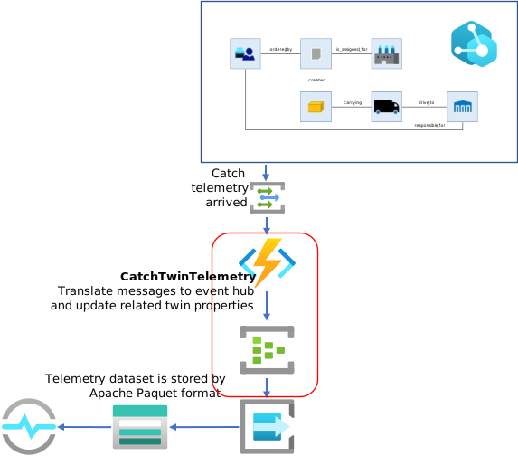

# How to build Catch Twin Telmetry Function  
ここでは、Azure Digital Twins に Publish されたテレメトリーデータを収集するアプリの作成を解説する。  
CatchTwinTelemetry の位置付けは以下に示す。  
  
作成手順は、以下の通り。  
1. VS Code で Event Grid Trigger の Function を作成し、一旦、Azure に Deploy  
1. Event Grid Topic を作成  
1. Event Grid Topic に、CatchTwinTelemetry function を割り付ける  
1. Azure Digital Twins に作成した Event Grid Topic で Endpoint を作成  
1. Azure Digital Twins に作成した Endpoint で、Telemetry のみを受信する Filter 設定で Event Route を作成  
1. local.settings.json に送信用の Event Hub の接続文字列を追加 : Event Hub 名は "twintelemetry"  
1. VS Code で、CatchTwinTelemetry の Run メソッドを実装し、Azure に Deploy  

各ステップの具体的な作業方法は、全て、[HowToBuildPropagateConsistencyTwinGraph.md](HowToBuildPropagateConsistencyTwinGraph.md) で解説されているので、そちらを参考に作業を進めてほしい。  
具体的なサンプルを、[samples/function/twingraph/CatchTwinTelemetry.cs](../samples/function/twingraph/CatchTwinTelemetry.cs) に用意してあるので、そちらも参照の事。  

---
# 時系列データを Time Series Insights で保存、グラフ化する。  
CatchTwinTelemetry は、Azure Digital Twins で Publish されたテレメトリーデータを Event Hub に流すので、その Event Hub の Listen アクセスポリシーを使って、Time Series Insgihts Event Source を作成すれば、手軽に、
- 時系列データに適したフォーマットで Azure Storage のコンテナーに蓄積  
- Time Series Insights Environment を使ったグラフ表示化  
- Time Series Insights API による高速な時期列データのアプリからのクエリー  
が可能である。  
詳しくは、「[Azure Time Series Insights ドキュメント](https://docs.microsoft.com/ja-jp/azure/time-series-insights/)」を参照の事。  