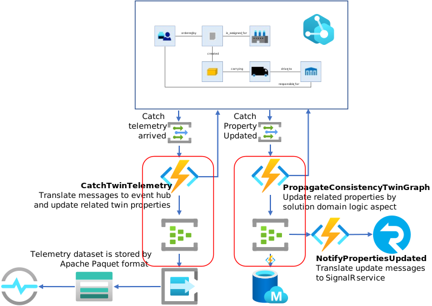

# Azure Digital Twins と連携する Function Apps の開発  
Visual Studio Code で開発を行う。  
Azure Function の VS Code による基本的な開発方法は、https://docs.microsoft.com/ja-jp/azure/azure-functions/functions-develop-vs-code?tabs=csharp を参照の事。  
開発言語は、C#、または、JavaScript を推奨する。  

## Event Grid Triger の Azure Function Project を作成する。  

VS Code の "View" → "Command Pallete" を選択し、図の様に、Azure Function Project の生成を開始する。  
  

Proect を格納するフォルダーを選択して、言語、フレームワークを選択する。  


Event Grid Trigger テンプレートを指定し、関数名と名前空間を入力する。  


Azure Function が動作するための Storage Account を指定すれば、以下のコードが自動生成される。  

```cs
// Default URL for triggering event grid function in the local environment.
// http://localhost:7071/runtime/webhooks/EventGrid?functionName={functionname}
using System;
using Microsoft.Azure.WebJobs;
using Microsoft.Azure.WebJobs.Host;
using Microsoft.Azure.EventGrid.Models;
using Microsoft.Azure.WebJobs.Extensions.EventGrid;
using Microsoft.Extensions.Logging;

namespace EmbeddedGeorge.DigitalTwins.Sample
{
    public static class UpdateProperties
    {
        [FunctionName("UpdateProperties")]
        public static void Run([EventGridTrigger]EventGridEvent eventGridEvent, ILogger log)
        {
            log.LogInformation(eventGridEvent.Data.ToString());
        }
    }
}
```

Twin Graph の変更時、該当する Event Grid が定義されていれば、eventGridEvent に変更内容が格納されて Run がコールされる。  
eventGridEvent の Data プロパティに変更内容が JSON で格納されているので、そこから以下の様なパターンで、どの Twin Class の、どの Property が変わったかを判別する。  
```cs
        var eventGridMsg = eventGridEvent.Data.ToString();
        dynamic messageJson = Newtonsoft.Json.JsonConvert.DeserializeObject(eventGridMsg);
        dynamic data = messageJson["data"];
        string modelId = data["modelId"];
        log.LogInformation($"modelId:{modelId}");
        if (modelId == productnModelId) {
            foreach (dynamic patch in data["patch"]) {
                dynamic pvalue = patch["value"];
                string ppath = patch["path"];
                log.LogInformation($" path:{ppath}");
                if (ppath == "/Location" && ppath == "replace") {
                    string pop = patch["op"];
                    float locX = pvalue["X"];
                    float locY = pvalue["Y"];
                    log.LogInformation($" op:{pop}, Location[X:{locX},Y:{locY}] for subject:{eventGridEvent.Subject}");
```


## Azure Digital Twins の Twin Graph 更新を知らせる Event Grid の作成  
Twin・Relationship の生成・削除、Property の更新、Telemetry発生 は、Event Grid 等を使ってキャプチャできる。  
  
Filter で特定の Twin Class や、Property の値がある条件を満たすときだけ通知するなどの設定が可能。  

作成方法は、https://docs.microsoft.com/ja-jp/azure/digital-twins/how-to-manage-routes-portal を参照の事。  

Azure Digital Twins で管理される、Twin Graph の変化をウォッチするだけであれば、Azure Digital Twins への接続は必要ない。  
Twin Graph への Telemetry 通知や、Twin Graph の変化をトリガーに、関連する Twin・Relationship を更新する場合は、Azure Digital Twins への接続が必要になる。  

## Azure Digital Twins SDK のインストール  
VS Code の Terminal で以下のコマンドを実行する。  
```sh
dotnet add package Azure.DigitalTwins.Core
```  
同じ要領で、
- Azure.Core  
- Azure.Identity  
- Newtonsoft.Json  
をインストールする。  

## Azure Digital Twins への接続  
VS Code で、Azure Function のプロジェクトを作成したときに自動生成される、local.settings.json の "Values" に、  
```json
  "Values": {
    "AzureWebJobsStorage": "DefaultEndpointsProtocol=https;AccountName=e...;EndpointSuffix=core.windows.net",
    "FUNCTIONS_WORKER_RUNTIME": "dotnet",
    "ADT_SERVICE_URL": "<- your Azure Digital Twins Instance Name ->.api.sea.digitaltwins.azure.net"
  }
```
の様に、<b>ADT_SERVICE_URL</b> の定義を追加する。<b><i>&lt;- your Azure Digital Twins Instance Name -&gt;</i></b> を、各自が作成したADT Instance 名で置き換える。  

```cs
Azure Function のクラスに、
        static DigitalTwinsClient twinsClient;
        static readonly HttpClient httpClient = new HttpClient();
        static readonly string adtInstanceUrl = Environment.GetEnvironmentVariable("ADT_SERVICE_URL");
```
と、static 変数を追加する。  
これらを使って、生成された Run メソッドに、  
```cs
        public static async Task Run(......, ILogger log, ExecutionContext context)
        {
            var exceptions = new List<Exception>();
            if (twinsClient == null) {
                try{
                    if (string.IsNullOrEmpty(adtInstanceUrl)) log.LogInformation("Application setting \"ADT_SERVICE_URL\" not set.");
                    else log.LogInformation($"Got {adtInstanceUrl}");
                    var credential = new ManagedIdentityCredential("https://digitaltwins.azure.net");
                    twinsClient = new DigitalTwinsClient(
                        new Uri(adtInstanceUrl),
                        credential,
                        new DigitalTwinsClientOptions {
                            Transport = new HttpClientTransport(httpClient)
                        }
                    );
                    log.LogInformation($"ADT service client connection created - {adtInstanceUrl}");
                }
                catch (Exception ex) {
                    exceptions.Add(ex);
                    log.LogWarning($"ADT Exception - {ex.Message}");
                }
            }
```
の様に、引数として、<b>ExecutionContext context</b> を追加し、ADT への認証ロジックを追加する。この方式で同じ Azure Subscription で作成された ADT Instance に接続ができ、[WPF Application の開発方法](./HowToBuildWPFApp.md) で解説されている、Twin Graph の操作が行える。  

## Azure Digital Twins への Telemetry データの入力  
以下のようなコードで、Telemetry データを生成する。  
```cs
        var telemetry = new {
            currentLocation = new {
                longitude = msg.longitude,
                latitude = msg.latitude,
                attitude = msg.attitude,
                measuredtime = msg.timestamp
            }
        };
        var telemetryJson = Newtonsoft.Json.JsonConvert.SerializeObject(telemetry);
        await twinsClient.PublishTelemetryAsync(truck.Id, Guid.NewGuid().ToString(), telemetryJson);
        log.LogInformation($"Published Truck[{truck.Id}]'s telemetry - {telemetryJson}");
```  

## Event Hub へのメッセージ送信  
Twin Graph の更新や、Telemetry Data 受信をトリガーに処理したデータを、別のサービスに転送する場合は、[Event Hub](https://docs.microsoft.com/ja-jp/azure/event-hubs/event-hubs-about) を使用する。  
[Event Hub](https://docs.microsoft.com/ja-jp/azure/event-hubs/event-hubs-about) は大量のデータを高速に別のサービスに転送可能なメッセージキューサービスであり、既存の Event Hub に対して様々なサービスをサブスクライブし、データを受信できるので、どのようなサービスと連携するか決まっていなくても、とりあえず Event Hub に転送しておきさえすれば、様々なサービスを後付けしてシステムの拡張が可能である。  

Azure Function では、[Event Hub Output Binding](https://docs.microsoft.com/azure/azure-functions/functions-bindings-event-hubs-output?tabs=csharp) を使って、簡単に Event Hub にメッセージを送信できる。  
  

Event Grid Binding テンプレートで作成した、Azure Function に Event Hub 出力バインディングを追加するのは非常に簡単である。  
https://docs.microsoft.com/ja-jp/azure/event-hubs/event-hubs-get-connection-string を参考に、"<b>Send</b>" 権限を持つ、共有アクセスポリシーの接続文字列を取得する。  
Function プロジェクトの local.settings.json の Values に取得した接続文字列を追加する。  
```json
  "Values": {
    "AzureWebJobsStorage": "DefaultEndpointsProtocol=https;AccountName=...;EndpointSuffix=core.windows.net",
    "FUNCTIONS_WORKER_RUNTIME": "dotnet",
    "outputEventhubConnectionString": "Endpoint=sb://....servicebus.windows.net/;SharedAccessKeyName=sender;SharedAccessKey=...;EntityPath=update-twin-properties",
    "ADT_SERVICE_URL": "https://....api.sea.digitaltwins.azure.net"
  }
```  
<b><i>update-twin-properties</i></b> は、出力先の Event Hub の名前と一致していなければならない。  
K<b><i>outputEventhubConnectionString</i></b> は、別の文字列でもよいが、次の Run メソッドに追加する Attribute で使用する名前と同じにしなければならない。  
次に、Run メソッドの引数に以下の様に、
```cs
        public static async Task Run([EventGridTrigger]EventGridEvent eventGridEvent,
            [EventHub("update-twin-properties",Connection="outputEventhubConnectionString")] IAsyncCollector<string> outputEvents,
            ILogger log, ExecutionContext context)
        {
```
と、Attribute 付の <b>outputEvents</b> という引数を追加する。これにより、Azure Function の Runtime がこの変数が、Event Hub への出力バインディングであることを認識してくれて、この変数に、Event Hub に送信したメッセージを書き込むだけでメッセージ出力が可能になる。  
Event Hub への送信は以下の様なコードで実現できる。  
```cs
        var outputJson = new {
            ModelId = truckModelId,
            TruckId = truck.Id,
            Location = new {
                longitude = truck.longitude,
                latitude = truck.latitude,
                attitude = truck.attitude,
                measuredtime = truck.measuredtime
            }
        };

        log.LogInformation("Sending truck location to...");
        await outputEvents.AddAsync(Newtonsoft.Json.JsonConvert.SerializeObject(outputJson));
        log.LogInformation("Send.");
```

## Azure Function を Azure に配置する。  
一通り設定とロジックのコーディングが済んだら、Azure に配置を行う。  
Event Hub や IoT Hub を Binding した Function の場合、開発している Local 環境側に、Binding 先のサービスの接続文字列等が全て揃っているので、Azure への配置をせずに、開発用 PC の上で、実際にクラウド上で受信したメッセージを使ったデバッグが可能であるが、Event Grid Binding の場合は、Azure 側にしかメッセージルーティング情報が無いので、Local 環境ではデバッグができない。  
そのため、  
1. Azure 上で、Event Grid Binding の Azure Function を作成  
2. Azure 上で作成した、Azure Function に、Event Grid Topic を割り付ける  
3. VS Code で開発した Function を Azure に配置  
という順番で行う。  
