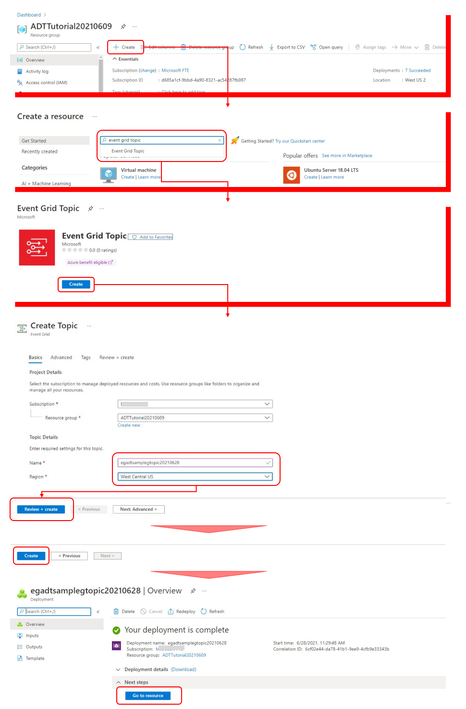

# How to build Propagate Concistency Twin Graph  
IoT Hub からの実デバイスが生成するデータのインプットや、WPF アプリ等による Twin Graph 上の Twin の Properties 更新、Relationship の生成・削除等は、一時的に Twin Model で定義された概念全体からすると局所的な不整合を起こしうる。  
本サンプルのシナリオでは、Twin Graph の一部が更新されることによって、  
|状況|条件|必要な処理|
|-|-|-|
|Cooling Container Truck の Location 更新|carring で関連付けられた Product が存在|Product の位置情報更新|
|Cooling Container Truck の Container Temperature 更新|同上|Product の温度情報更新|
|Delivery Truck の Location 更新|carring で関連付けられた Product が存在|Product の位置情報更新|
|Temperature Measurement Device のテレメトリーデータ|target で関連付けられた Product が存在|Product の温度情報更新|
|Product の温度情報更新|無条件|温度の許容最低・最高温度をチェックして必要であれば Status を更新|
|Cooling Container Truck の Status 更新|-carring->Product-created->Order で関連付けられた Order が存在|必要であれば Order の Status を更新|
|Delivery Truck の Status 更新|-carring->Product-created->Order で関連付けられた Order が存在|必要であれば Order の Status を更新|

等々、不整合を解決する必要が生じる。  
※ もちろん、IoT Hub からのデータを元に Twin Graph を操作する際に、一気にやってしまうような実装も可能だが、Twin Model は、IoT Hub が管理する概念世界よりも、ビジネスソリューション側の概念世界の事情が主であるので、ソフトウェアの設計原則の観点から、分けて実装するべきであろうとの判断である。  

以下、このようなロジックの作成方法を、[samples/function](../samples/function)を例に解説する。  

---
## 構成  
下図の PropagateConsistencyTwinGraph を実装する。  
  

※ 以下の手順を実施する前に、"[IoT Hub から送られた Telemetry データを元に、Azure Digital Twins の Twin の Telemetry メッセージを送信する](./HowToConnectIoTHubToADT.md)"を実施すること。  

## Function の作成  
"[IoT Hub から送られた Telemetry データを元に、Azure Digital Twins の Twin の Telemetry メッセージを送信する](./HowToConnectIoTHubToADT.md)" で作成した VS Code の Workspace で作業を行う。  
※ これは、特にそうしなければならないという事ではなく、あくまでもチュートリアルとしての管理や作業の容易さを保つ事と、Function を作成する一つの方法の紹介することを目的としている。  

[samples/function/adt-op](../samples/function/adt-op) を VS Code で開き、"View"→"Command Palette"で、"Azure Functions: Create Function" を選択して、以下を実行する。  
  
関数名は、"PropagateConsistencyTwinGraph"とする。  

Command Palette で選択する部分以外は、[samples/funciton/adt-op](samples/function/adt-op) の IoTHubTranslator を作成した手順と同じです。  
VS Code 上で Function を作成したら、一旦、Azure 上の IoTHubTranslator をデプロイした Function App にデプロイを行う。  
※ 以降の作業で選択可能にするため  

以下、Deploy した Function に Azure Digital Twins の Twin Graph 更新通知を流すための作業を行う。順番は以下の通り。  
1. Event Grid Topic の作成  
1. Event Grid Topic を Function にバインド  
1. Event Grid Topic で、Azure Digital Twins に Endpoint を作成  
1. Endpoint への Event Route を作成  

### Event Grid Topic の作成
次に、作成した Function に Azure Digital Twins の Twin Graph の変更を通知するための、Event Grid Topic を作成する。  
Azure Digital Twins や IoT Hub のインスタンスが所属する Resouce Group を Azure Portal で開き、Event Grid Topic を検索して作成する。  
  

Region は、Azure Digital Twins インスタンスと同じを推奨する。  

### Event Grid Topic を Function にバインド
Event Grid Topic が出来上がったら、Function をバインドする。  
こちらも、基本的な手順は、IoT Hub からのメッセージルーティングと同じである。  
  

### Event Grid Topic で、Azure Digital Twins に Endpoint を作成   
Azure Portal で、Azure Digital Twins インスタンスを開き、"Endpoints" を選択して、以下の手順で Endpoint を作成する。  
  


### Endpoint への Event Route を作成  
引き続き Azure Portal で、"Event routes" を選択して、以下の手順で Event Route を作成する。  
  

手順の中で、"Add Event route filter" という項目があり、ここで、受信する Twin Graph 更新項目を選択する。"Advanced editor" を Enable にすると、例えば、特定の Model Id や 特定の $dtId の Twin 呑みの更新をルーティングするなど、更に詳細な条件を設定できる。  

ここまでの設定を済ませて、WPFアプリやシミュレータを実行して、Twin Graph の更新、テレメトリーデータの送信を行うと、イベントがルーティングされて、Deploy した Function が起動され、受信したメッセージがモニターできるので確認してみてほしい。  

---
## Event Hub へのメッセージ転送  
"[Azure Digital Twins にアクセスして動作する WPF Application](./HowToBuildWPFApp.md)" で作成した WPF アプリに Twin Graph の更新を通知するための仕組みを追加する。  
Function の処理としては、Event Hub への出力を追加し、その Event Hub に途中でメッセージを送信するだけでよい。  
※ このサンプルでは、メッセージ送信先の Event Hub にサブスクライブしている Function が Signal R にメッセージ送信し、更にその SignalR にサブスクライブしている WPF アプリにデータを転送することを想定しているが、一旦、Event Hubに送信してしまえば、Event Hub に様々なサービスをサブスクライブすることにより、実装時に未定のサービスへのメッセージ供給も可能なアーキテクチャになっている。クラウドを活用したサービスへの要求は本来変わりやすいものであるので、このような拡張性あるアーキテクチャの採用は非常に重要である。  

手順は以下の通り。  
1. Event Hub 名前空間の作成  
1. Event Hub の作成  
1. Event Hub のアクセスポリシー設定  
1. Function への Event Hub Output Binding の追加  

### Event Hub 名前空間の作成  
Event Hub の詳細は[こちら](https://docs.microsoft.com/ja-jp/azure/event-hubs/event-hubs-about)を参照の事。  
同じ Resouce Group で以下の手順で、Event Hub 名前空間を作成する。  
※ ちょっとややこしいが、メッセージを受け渡すサービスは、"Event Hub"、Event Hub は "Event Hub 名前空間" で作る。一つの名前空間に複数の Event Hub を作成可能  
  
Region は、Function を Deploy した Region と同じ場所を推奨する。  

### Event Hub の作成  
出来上がった Event Hub 名前空間に2つの Event Hub を追加する。名前は以下の通りとする。  
- twintelemetry  
- twingraphupdate
  
作成された Event Hub は、Event Hub 名前空間のページの下の方にリストされる。  

### Event Hub のアクセスポリシー設定  
作成された Event Hub を選択して、送信（send）、受信（listen）用のアクセスポリシーを設定する。  
  
ADT → Function が送信する場合、send を使用する。  
Event Hub は二つ作成するので、その二つともアクセスポリシーを設定する。  

### Function への Event Hub Output Binding の追加  
作成した Event Hub を PropagateConsistencyTwinGraph 関数に出力用 Event Hub としてバインドする。  
VS Code で、local.settings.json を開き、"eventhub_output_cs"を追加する。  
```json
{
  "IsEncrypted": false,
  "Values": {
    "AzureWebJobsStorage": "DefaultEndpointsProtocol=https;AccountName=...",
    "FUNCTIONS_WORKER_RUNTIME": "dotnet",
    "ADT_SERVICE_URL": "https://...",
    "eventhub_output_cs": "Endpoint=sb://...;SharedAccessKeyName=send;SharedAccessKey=..."
  }
}
```
<b><u>"Endpoint=sb://...;SharedAccessKeyName=send;SharedAccessKey=..."</u></b> の部分は、Azure Portal から、twingraphupdate の send ポリシーをコピペする。  
  

VS Code の Terminal で以下を実行し、Event Hub 用の Extention をインストールする。  
```sh
dotnet add package Microsoft.Azure.WebJobs.Extensions.EventHubs
```

次に、PropagateConsistencyTwinGraph クラスの Run メソッドを以下の様に改造する。  
<b><u>改造前</u></b>  
```cs
        [FunctionName("PropagateConsistencyTwinGraph")]
        public static async Task Run([EventGridTrigger]EventGridEvent eventGridEvent, ILogger log)
        {
            var eventGridEventData = eventGridEvent.Data.ToString();
```
<b><u>改造後</u></b>  
```cs
        [FunctionName("PropagateConsistencyTwinGraph")]
        public static async Task Run([EventGridTrigger]EventGridEvent eventGridEvent,
            [EventHub("update-device-properties",Connection="eventhub_output_cs")] IAsyncCollector<string> outputEvents,
            ILogger log)
        {
            var eventGridEventData = eventGridEvent.Data.ToString();
```
以上の設定で、Run メソッドのロジック内で、  
```cs
            await outputEvents.AddAsync(msgJson);
```
の様に書けば、Event Hub に msgJson に格納された文字列が送付される。  
※ とても簡単！  

サンプルでは、以下の情報を Event Hub に送信している。  
|Twin|送付情報|
|-|-|
|Cooling Container Truck|Location、Status|
|Delivery Truck|Location, Status|
|Order|Status|
|Product|Location, Temperature|  

※ Event Hub へのメッセージ送信は、冒頭で言及した設計原則からすれば、PropagateConsistencyTwinGraph Function に入れるのはいかがなものかという感もあるが、簡単のため、同じ関数での実装を選択している。  

Event Hub は、大量のメッセージを送受信する様なソリューションで、サービス間を接続する際に使う鉄板のサービスであり、ここで説明した設定方法は是非習得してほしい。  
