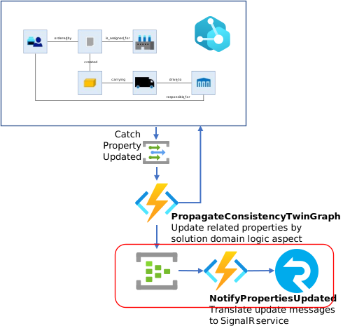
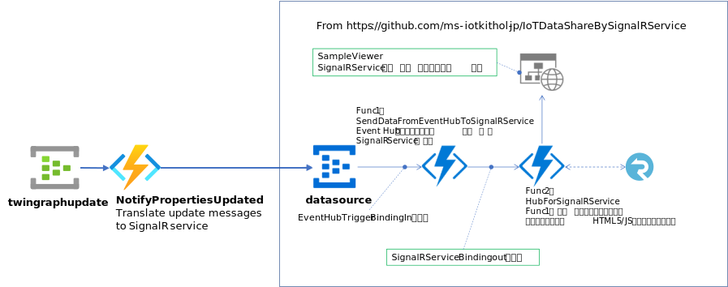
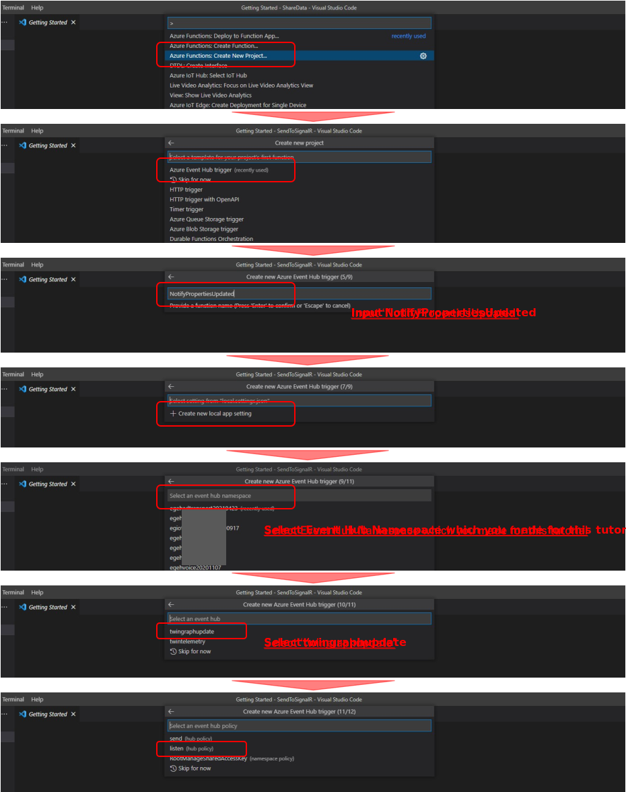

# How to Build Send to SignalR Function  
ここでは、PropagateConsistencyTwinGraph Function が Event Hub の twingraphupdate に送信したメッセージを SignalR Service を使って、関心のあるアプリやサービスに同報通信する部分の作成方法を解説する。  
  

SignalR Service を使った仕組みの構築は、https://github.com/ms-iotkithol-jp/IoTDataShareBySignalRService を参考にしてほしい。  
上図の、"<b>NotifyPropertiesUpdated</b>" Function 内では、このリポジトリで紹介している図の、Event Hub にデータを送信するロジックを実装する。  

より詳細な構成は下図のようになる。  
  
※ SignalR への入力として使用する Event Hub の名前は、"<b>datasource</b>" として説明する。  

"<b>NotifyPropertiesUpdated</b>" Function の作成は、VS Code で Event Hub Trigger Input Binding の Function を作成し、それに、Event Hub Trigger Output Binding を追加する方法を紹介する。  

説明に従って作成した <b>NotifyPropertiesUpdated</b>を[samples/function/sendtosignalr](../samples/function/sendtosignalr)においてあるので、参考にしてほしい。  

## Event Hub Trigger Input Binding の Function 作成  
新しく適当なフォルダーを用意し、VS Code で Function を作成する。  
  
途中、入力として使用する Event Hub "twingraphupdate" の選択と、アクセスポリシーの選択を間違えない事。  

## Event Hub Trigger Output Binding の追加  
追加方法は、[HowToBuildPropagateConsistencyTwinGraph.md](./HowToBuildPropagateConsistencyTwinGraph.md) で説明されているので、そちらを参考にしてほしい。  
参考例として、  
<b><u>local.settings.json</u></b>  
```json
{
  "IsEncrypted": false,
  "Values": {
    "AzureWebJobsStorage": "DefaultEndpointsProtocol=https;AccountName=...",
    "FUNCTIONS_WORKER_RUNTIME": "dotnet",
    "twinhub_listen_EVENTHUB": "Endpoint=sb:...;SharedAccessKeyName=listen;SharedAccessKey=...;EntityPath=twingraphupdate",
    "signalrhub_send_EVENTHUB": "Endpoint=sb:...;SharedAccessKeyName=sender;SharedAccessKey=...;EntityPath=datasource"
  }
}
```
|接続文字列名|値のソース|用途|
|-|-|-|
|twinhub_listen_EVENTHUB|twingraphupdate の listen 権限を持つアクセスポリシー|PropagateConsistencyTwinGraph の出力を受信|
|signalrhub_send_EVENTHUB|datasource の send 権限を持つアクセスポリシー|SignaR による同報通信への送信先|  

<b><u>NotifyPropertiesUpdated.cs</u></b>  
```cs
    public static class NotifyPropertiesUpdated
    {
        [FunctionName("NotifyPropertiesUpdated")]
        public static async Task Run([EventHubTrigger("twingraphupdate", Connection = "twinhub_listen_EVENTHUB")] EventData[] events,
            [EventHub("datasource",Connection="signalrhub_send_EVENTHUB")] IAsyncCollector<string> outputEvents, ILogger log)
        {
```

[samples/function/sendtosignalr/NotifyPropertiesUpdated.cs](samples/function/sendtosignalr/NotifyPropertiesUpdated.cs) では、twingraphupdate に送信されたメッセージを何も加工せずに、datasouce に送信している。  

---
## SignalR への Subscribe と同報通信の受信  
[HowToBuildWPFApp.md](./HowToBuildWPFApp.md) で解説している WPF アプリケーションに SignalR への Subscribe とメッセージ受信を行う機能を追加する。  
WPF アプリケーションは、SignalR のサービスを構成する Function の "HubForSignalRService" の URL にアクセスし、SignalR Service の URL と Access Token を取得し Subscribe を行う。  
  

※ 本サンプルでは、HubForSignalRService へのアクセス権の設定を特にしていないので、誰でもアクセス可能であるので、実ソリューションでは、認証済みの接続のみを許可する設定にする必要がある。  

Signal R Service への Subscribe、メッセージ受信方法は、[HowToBuildWPFApp.md](./HowToBuildWPFApp.md#signalr-を利用したtwin-情報更新通知の受信) の説明を参照の事。  

Web アプリ等からの Subscribe、メッセージ送信については、https://github.com/ms-iotkithol-jp/IoTDataShareBySignalRService/tree/master/SampleViewer をご覧いただきたい。  
