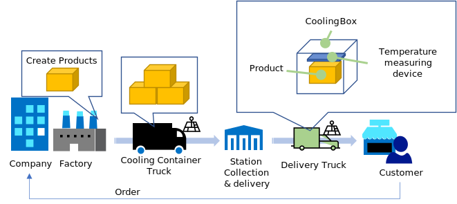
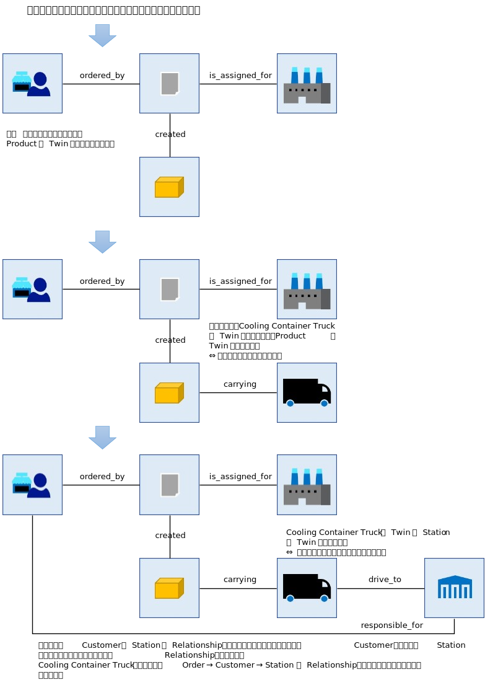
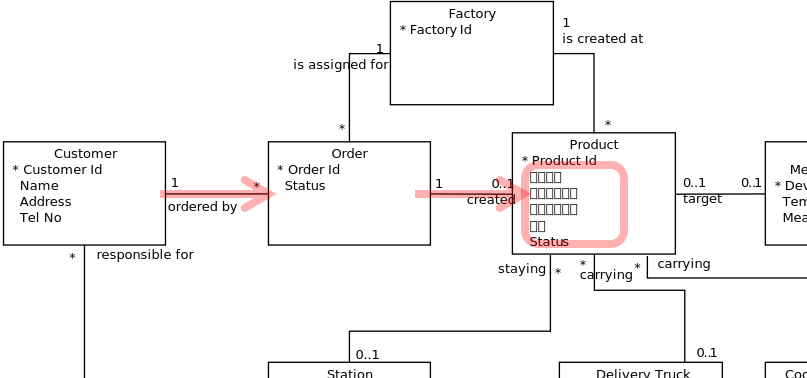

# Tutorial - Twin Model の作成  
Simple すぎるシナリオだと理解が深まらない。かといって、複雑すぎると訳が分からなくなって理解が深まらない。  
適当なレベルの、在りそうなシナリオを元に、Azure Digital Twins、Azure IoT Hub、及び、関連する諸サービスの使い方を学習する。  
尚、モデリングには正解はなく、シナリオに応じて変わりうるもの（実際に使ってみて問題があれば修正すればよい）なので、ここで示すモデルは、あくまでも一つの参考例として公開している。  

## Scenario  
温度管理が必要な製品の顧客からの発注、生産、配送、顧客の受け取りを管理するシステムを開発する。  
最低限の要件は以下の通り。  
1. 温度管理が必要な製品がある。その製品は生産されてから顧客に届くまで、決められた温度範囲に保たれなければならない。  
1. 顧客に対し、発注した製品が製造中なのか、発送後はどこにあるか、温度は保たれているかを知らせることができる  
1. その製品は、顧客からの受注で工場で生産する。生産された製品は一旦、顧客の近辺の集配場に運ばれ、その集配場から顧客の元に届けられる。  
1. 工場と集配場の間の運搬は温度管理が可能なコンテナが装備されたトラックで行われる。コンテナ内の温度はトラックに装備された装置でモニターできる。  
1. 集配場から顧客までの運搬は温度計測機器とともに保温ボックスに入れられて運ばれる。運搬は温度管理機能は装備されていないトラックで行われる。温度計測機器は、ドライバーが持つモバイル端末と通信し、現在の温度をモニターできる。  
1. 顧客に届けた時点で温度計測機器は回収され次の運搬で利用される。  
1. トラックにはGPS等を元にした位置検知機器が装備されている。  
1. トラックの位置、コンテナ、及び、保温ボックスの温度は無線回線で遠隔からモニタリング可能である。  



---
## Modeling  
シナリオを元に、Twin Class と Relationship 抽出し、Digital Twin Model を作成する。    
1. 開発するシステムの観点から、注目しなければならないエンティティをリストアップ。  
1. 開発するシステムの観点から、注目しなければならないエンティティ間の Relationship をリストアップ。  
1. それぞれのエンティティの識別子、共通 Propertyを抽出し、Twin Class を定義。  
1. Twin Class 間の Relationship を定義。  
1. Twin Class 毎に、Relationship も含んだ、DTDL ファイルを作成。  

といったような手順を踏んで、じっくりと考えていただきたい。  

参考として、下図にモデル化の例を示す。  

### Twin Class 候補のリストアップ  

  

考察  
- 製造会社は候補か？ - 製造会社が自社製品の搬送のみを考えているなら、Twin Class として扱わなくてよいだろう。一方で、複数の製造会社に導入してほしいシステムを開発するなら、Twin Classとして扱ったほうがいいだろう  - 本Tutorial では、簡単のため前者を採用
- 工場は複数あるのか？ - 複数あるなら顧客の注文発生時にどうやって生産する工場を選択する？ - 本Tutorialでは簡単のため工場は一つとして扱う。複数ある場合は、きっと選択するための基準となる Property を持つことだろう  
- 顧客は確実に Twin Class になりそうだが、同時に複数の製品を注文するのか？また、それぞれの注文の配送先は全て同じなのか、それとも複数あるのか？ - 配送先が複数なら、それを識別するための、例えば、"顧客配送先"という名前の Twin Class が必要になるだろう。 - 本 Tutorial では簡単のため、配送先は一つとし、発注は同時に複数とする。  

等々、色々と考えて、Twin Class、Relationship をリストアップしていく。  

ここでは、以下の様に Twin Class を定義する。  

|Twin Class Name|Description|
|-|-|
|Factory|製品製造場所、製品発送の起点として|
|Product|温度管理・配送対象|
|Customer|顧客。届け先は一か所とする|
|Order|複数の発注が同時に存在するので区別のため|
|Station|配送ステーション|
|Cooling Container Truck|工場から配送ステーションまで温度管理されたコンテナーで製品を輸送するトラック。本トラックにはGPSで位置情報を取得し、IoT Hub に送信する機能を持っている|
|Delivery Truck|配送ステーションから顧客に製品を保温ボックスに入れて配送するトラック。ドライバーが持っているモバイル端末が、GPSから取得した位置情報を IoT Hub に送信する。|
|Temperature Measurement Device|保冷ボックスに入れて製品の温度を測る。シナリオによれば、本機器はドライバーが持っているモバイル端末を通じて温度情報を IoT Hub に送信することになっているが、システム上では本機器からのデータとして扱う。|


---
### Twin クラスの Property のリストアップ
シナリオを元に、各 Twin Class が持つ Property をリストアップする。Twin Class をひな型として定義される各 Twin（Instance）は、同じ特徴値のセットを持ち、それぞれ区別可能なものであり、開発したいシステムが扱う現実世界に存在する、区別可能でかつ数え上げ可能なモノや概念を表す。  
Property には、
- 個々を区別するための識別子  
- Twin を特徴づける変数  

の二種類がある。前者については、Azure Digital Twins では、各Twinは、Azure Digital Twins がデフォルトで持っている、$dtId という識別子がある。$dtId は、空文字や日本語、特殊記号などを保持することができない。シナリオ上、それで十分なら特に、識別子 Property を定義する必要はないが、シナリオ上、個々の Twin を区別するための意味のある変数がある場合は、適切な変数名を付与し、Property として定義する。  
後者については、シナリオ上、保持、共有が必要な変数をリストアップする。例えば Customer であれば、  
- 名前（Name）
- 住所（Address）
- 電話番号（Tel No）  

あたりが、普通に出てくる Property となる。  
このドキュメントは、チュートリアルなので、まぁ、こんな感じの Property だろう…というレベルの Property セットを図には示してあるので、参考にしていただきたい。  


※ モデリングという工程においては、"住所"って、Customer の居場所のこと？それとも配送先の住所の事？といった質問が出てくる場合もあり、「配送先なら Customer の Property ではなくて、Order の Property では？」といったディスカッションを経て、Twin Model が出来上がっていく事が望ましい。  

例えば、シナリオでは製品の位置もハンドリングすることになっているので、輸送中の Truck の 位置（Location）という Property を定義するのは自然であろう。（製品が輸送中の場合、その製品を運んでいるトラックの位置を製品の位置として使うことに問題はないはず）位置（Location）は、Truck が移動するにつれて、当然変化していく。このように時間の経過で変化していくような変数の場合、  
- 今どこにいるか？
- 時刻ごとにどこにいるか？  

の二つの観点がありうる。このような変数の場合は、"今どこにいるか”を表す Property に加えて、時系列的に取得したい変数セットを Telemetry として Twin Class に定義することができる。  
  


---
### Relationship のリストアップ  
Twin Class をひな型に存在する、Twin（Instance）と、別の Twin Class の Twin（Instance）の間の関係を考察する。  
開発するシステムとして意味のある関係を抽出していく。何か関係があると考えられる場合、<b><u>双方から見た相手の意味</u></b>と、<b><u>双方から見て相手が幾つあるか(多重度)</u></b>を、考察する。  


例えば…
|Source|Target|意味、多重度等|メモ|
|-|-|-|-|
|Customer|Order|1 - has_order - *|顧客は複数の注文を同時に行えるのでこの多重度にした。顧客から見た注文の多重度が 0 からなので注文をしていない顧客も Twin Graph で管理可能になっている|
|Factory|Order|0..1 - create_product_for - *|注文に対して製品を生産する工場を示す。工場側の多重度が 0..1 で 0 を許しているので、どこで生産するか決まっていない注文を Twin Graph で表現可能にしている|
|Order|Product|1 - produced_for - 0..1|注文に対して生産された製品|
|Cooling Container Truck|Product|0..1 - carry - *|温度管理されたコンテナーを持つトラックが製品を運んでいることを示す|
|Cooling Container Truck|Station|* - drive_to - 0..1|温度管理されたコンテナーを持つトラックが集配ステーションに向かって移動中であることを示す|
|…|…|…|…|

…と、いった様に、シナリオ上で発生しうる状況を元に Relationship をリストアップする。  

---
### Twin Model の定義  
これまでの考察から、いきなり JSON で DTDL でテキスト化してもいいのだが、なかなかに見通しが悪いので、UML 表記で図示化するとよい。  
  
※ あくまでも参考であり、必要最低限の Property、Relationship しか記載していない。  
※ 全ての Twin は、この図上の Twin Class のインスタンスであり、その Twin Class に定義された Property を持ち、他のTwin Class のインスタンスとの Relationship を満たさなければならない。  
※ プロパティで、右側に &lt;&lt;T&gt;&gt; が付与されているものは、"Telemetry" であることを示している。  
※ UML による Notation の概要は、[HowToBuildTwinMode.md](./HowToBuildTwinModel.md) を参照の事。

---
### DTDL による Twin モデルの定義  
図で示したモデル上の Twin Class 毎に DTDL による JSON ファイルを作成する。  
DTDL の name プロパティは、日本語や空文字は使えないので英語化、"_" 化等で置き換える。  
※ 日本語表記を入れたい場合は、"displayName" に記載すればよい。  
Twin Class と Relationship は、以下の形式の id を必要とするので、予め <b><i>namespace</i></b>を決めておく。  

dtmi:<b><i>namespace</i></b>:<b><i>twin_class_or_relationship_name</i></b>;1

※ このチュートリアルでは、namespace を "embeddedgeorge:transport:const_temperature:sample" として話を進める。  
なお、DTDL では、Relationship の定義は、Twin Class の定義内で行うことになっているので、図に示したモデル上の Relationship は、意識的に書いている場所を決めている。各 Relationship を定義する場合は、書かれている反対側の Twin Class に定義を行う。  

DTDL ファイルの作成は、[VS Code のDTDL作成用拡張機能](https://docs.microsoft.com/ja-jp/azure/iot-pnp/howto-use-dtdl-authoring-tools)が便利で間違いにくいので、それを使って作成する。  

DTDL で定義したファイルをサンプルとして示す。  
|Twin Class|DTDL FIle|
|-|-|
|Customer|[/models/Customer.json](../models/Customer.json)|
|Order|[/models/Order.json](../models/Order.json)|
|Product|[/models/Product.json](../models/Product.json)|
|Factory|[/models/Factory.json](../models/Factory.json)|
|Station|[/models/Station.json](../models/Station.json)|
|Temperature Measurement Device|[/models/TemperatureMeasurementDevice.json](../models/TemperatureMeasurementDevice.json)|
|Truck|[/models/Truck.json](../models/Truck.json)|
|Delivery Truck|[/models/DeliveryTruck.json](../models/DeliveryTruck.json)|
|Cooling Container Truck|[/models/CoolingContainerTruck.json](../models/CoolingContainerTruck.json)|

---
## Twin Model の Twin と Relationship による Dynamics  
シナリオ上に現れる様々な概念、状況、開発したいシステムが扱う Entity、Entity間の関係は、Twin Model で表現可能になっている必要がある。  
冒頭に挙げたシナリオには、
1. 顧客が製品を発注する。
1. 製品を生産する工場を割り当てる。
1. 製品を温度制御可能なトラックで配送ステーションに移送する  
1. 配送ステーションに到着後、ステーションに運び込む

といった状況があり、それぞれ、Twin Graph で表現すると、  
最初のシナリオでは、  
  

次のシナリオでは、  
  

次のシナリオでは、  


最後のシナリオでは、

こんな形で、Twin Graph でシナリオの各シチュエーションが表現される。  
他のシチュエーションについても、各自考えていただきたい。  

---
## Twin Graph を使って情報を取得する。  
シナリオ実装におけるデータ参照は、Twin Model をベースに行われる。  
例えば、ある顧客が発注している製品が今どこにあって、許容半にの温度で保たれているかを知りたい場合は、  
  

図の様に、Customer と Order 間の関係 "ordered_by" と Order と Product 間の関係 "created" を辿って、特定の顧客が注文している Product の Twin が全て取得でき、それぞれの、現在温度、位置を参照できる。  
他に、例えば、Cooling Container Truck が何らかのアクシデントに見舞われた時に、影響を受ける Customer に連絡しなければならない、といったシチュエーションが生じた場合は、  
  
図の様に、Relationship を辿れば、影響を受ける Customer の Twin リストを取得可能である。  
このように、情報の検索は、Twin Model で定義された Relationship を使って定義したクエリーで行われる。    
現実世界は時々刻々と変化していくので、扱う対象が大規模かつ複雑であればあるほど、一般的に検索処理や更新処理の開発が困難になっていくものであるが、比較的安定している Twin Model が定義されているので、そのモデルで定義されたルールに従って情報を辿る仕組みを一貫して構築できる。  


---
## Twin Model ベースで開発を進める  
一旦、Twin Model ができたら、シナリオの詳細化、個別の深堀を進める場合に、必ず、Twin Model で定義された、Twin Class、Property、Telemetry、Relationshipで定義した概念、用語を使って会話することを推奨する。会話の中で Twin Model では表現できないような言葉や概念が出てきた場合は、Twin Model を見直す。  
※ 著者の経験から、残念ながら開発にかかわる全ての人がモデルを理解できるわけではなく、分からない人にモデルの理解を強要するとお互いの幸せな関係を壊す事態に陥らないとも限らないので、モデルが理解できるモデルの作成者や管理者側が、理解できない人たち向けに、分かる形で説明・ディスカッションすることも必要である。  


---
## Azure Digital Twins の作成と、ADT Explorer による Twin Graph の作成とクエリー  
https://docs.microsoft.com/ja-jp/azure/digital-twins/how-to-set-up-instance-portal を参考に、Azure Digital Twins を作成する。  
Azure Digital Twins インスタンスが作成されたら、Azure Portal で開いて、図に示す"Open Azure Digital Twins explorer"をクリックして、ADT Explorer を開く。  
  

https://docs.microsoft.com/samples/azure-samples/digital-twins-explorer/digital-twins-explorer/ を参考に、以下の作業を行う。  
- [models/](../models) に入っている全ての Json ファイルを、モデルの定義としてアップロードする。  
- ADT Explorer の "MODEL GRAPH" を選択し、定義したはずの Twin Class、Relationship が全て表示されているか確認する。
- 必要であれば、[model_icons](../model_icons) に入れてある、各 Twin Class 用のアイコンイメージを登録する。  
- シナリオからいくつかのシチュエーションを設定し、Twin の作成と Relationship の作成を行う。  
- https://docs.microsoft.com/ja-jp/azure/digital-twins/how-to-query-graph を参考に、いくつかのシチュエーションで、Twin を検索する。  

Azure Digital Twins に、Twin Class の定義ファイルをアップロードすると、記述ミスがある場合は、Parse Error が表示される。表示されたらError を修正して再度アップロードする。  
本チュートリアルでは、Truck を extends して定義した Twin Class が2つ定義されている。このような場合、まず、基底の Twin Class からアップロードしなければならない。  

---
### Query Reference 
ADT Explorer 及び、 ADT を利用するアプリケーション・ロジックは、Twin Model をベースにした Query を多用する。  
以下によく使われるフレーズを列挙する。  
#### Get All Query  
全ての Twin を取得する
```sql
SELECT * FROM digitaltwins
```

#### Get All Twin for a Twin Class  
ある特定の Twin Class の Twin を取得する。  
[Customer](../models/Customer.json) を例に
```sql
SELECT * FROM digitaltwins customer WHERE IS_OF_MODEL(customer,'dtmi:embeddedgeorge:transport:const_temperature:sample:Customer;1')
```
または、
```sql
SELECT * FROM digitaltwins WHERE IS_OF_MODEL('dtmi:embeddedgeorge:transport:const_temperature:sample:Customer;1')
```

#### Get Twin by Property Value  
特定の条件を満たす Property を持つ Twin を取得する。  
```sql
SELECT * FROM digitalwins WHERE CurrentTemperature > 0.0
``` 
または、特定の Twin Class を指定して取得する場合は、
```sql
SELECT * FROM digitaltwins product WHERE product.CurrentTemperature > 0.0 AND IS_OF_MODEL(product, 'dtmi:embeddedgeorge:transport:const_temperature:sample:Product;1')
```

#### Traverse Relationship  
Relationship は、双方向からの Traverse が可能である。  
Customer と Order の "ordered_by" を例に、  
Order Twin から それを発注した Customer Twin を取得する。  
```sql
SELECT customer FROM digitaltwins order JOIN customer RELATED order.order_by WHERE order.OrderId = 'o-138-00914' AND IS_OF_MODEL(order, 'dtmi:embeddedgeorge:transport:const_temperature:sample:Order;1')
```
Customer Twin から それが発注している Order Twin を取得する。  
```sql
SELECT order FROM digitalTwins order JOIN customer RELATED order.order_by WHERE customer.CustomerId = 's-010-02517' AND IS_OF_MODEL(order, 'dtmi:embeddedgeorge:transport:const_temperature:sample:Order;1')
```

Relationship の Traverse は多段も可能ではあるが、とりあえず、以上のパターンを覚えておけば、ロジックの作成においては十分戦える。  
Query 文法の詳細は、https://docs.microsoft.com/en-us/azure/digital-twins/how-to-query-graph を参照の事。  

---
[ADT を使ったアプリ開発](./HowToBuildAppWthADT.md)