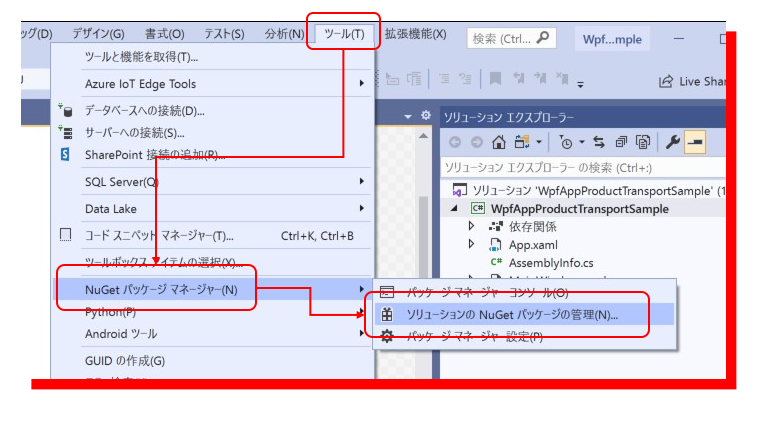
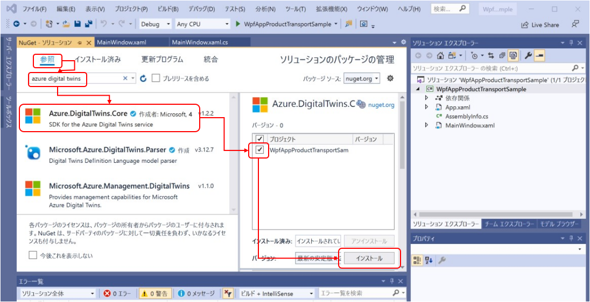
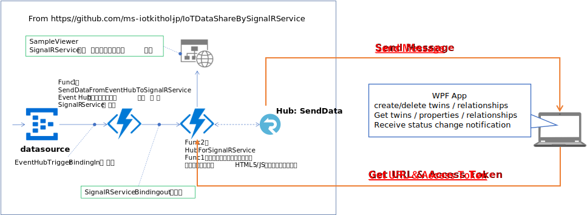

# Azure Digital Twins にアクセスして動作する WPF Application 

以下の一連のシナリオを試行するアプリケーションを作成する。    
1. Customer の作成  
1. Order の作成  
1. Order への生産 Factory 割り当て  
1. Product の生産完了と Cooling Container Truck の割り当て、及び Product の積み込み  
1. Cooling Container Truck による、Station への Product 移送  
1. Cooling Container Truck の Station への到着と、Station への積み下ろし  
1. Customer への配送用 Delivery Truck の割り当てと、Delivery Truck への積み込み  
1. Customer への Product 配送完了  

加えて、Product の位置情報と、Status を SignalR 配信で受信し表示する。  

※ Mobile 端末で動作するアプリケーションや Web アプリケーションも Azure Digital Twins にアクセスする方法の基本的な部分は同じである。  

アプリケーションの開発は、Visual Studio 2019 で、WPF .NET Core App テンプレートを使って行う。  
※ 参考 - https://docs.microsoft.com/en-us/dotnet/desktop/wpf/get-started/create-app-visual-studio?view=netdesktop-5.0  

---
## WPF Application への Azure Digital Twins SDK のインストール  
Azure Digital Twins へのアクセスに必要な SDK ライブラリのインストール方法は以下の通り。  
 
"ツール"をクリックし、"Nuget パッケージ マネージャ"→"ソリューションの Nuget パッケージの管理"の順に選択する。  
  
"参照"を選択し、検索窓に"azure digital twins"と入力する。  
"Azure.DigitalTwins.Core" が表示されるので選択して、インストール先のプロジェクトにチェックを入れて、"インストール"をクリックする。  
ライセンスへの同意等を行い、インストールを完了する。  
同じ要領で、以下の、認証や設定ファイルの読み込み、JSON 処理用の NuGet ライブラリーをインストールする。  
- Azure.Identity  
- Microsoft.Extensions.Configuration.Json  
- Newtonsoft.Json  

---
## Azure Digital Twins への接続  
### Azure Digital Twins インスタンスへのアクセス用設定  
プロジェクトに、appsettings.json というファイルを追加し、  
```json
{
  "adt-instance-url": "<- your Azure Digital Twins Instance URL ->"
}
```
<b><i>&lt;-  your Azure Digital Twins Instance URL -&gt;</i></b> は、各自が作成した Azure Digital Twins の <b>概要の Host name</b> を入力する。  

### Azure Digital Twins への接続ロジック   
```cs
    var config = new ConfigurationBuilder().AddJsonFile("appsettings.json", optional: false, reloadOnChange: false).Build();
    tbADTInstanceUrl.Text = config["instanceurl"];
    var credential = new DefaultAzureCredential();
    var instanceUrl = tbADTInstanceUrl.Text;
    if (!instanceUrl.StartsWith("http"))
    {
        instanceUrl = "https://" + instanceUrl;
    }
    twinsClient = new DigitalTwinsClient(new Uri(instanceUrl), credential);
```
DefaultAzureCredential ライブラリが認証処理を適宜行ってくれる。  


---
## Azure Digital Twins を使った、Twin Graph 操作ロジックのパターン  

### Twin の生成  
```cs
    var newCustomer = new BasicDigitalTwin()
    {
        Id = tbCustomerDtId.Text,
        Metadata =
        {
            ModelId = customerModelId
        },
        Contents =
        {
            {"CustomerId", customerId },
            {"Name", tbCustomerName.Text },
            {"TelNo",tbCustomerTelNo.Text },
            {"Address",tbCustomerAddress.Text }
        }
    };
    await twinsClient.CreateOrReplaceDigitalTwinAsync(customerId, newCustomer);
```

### Twin Property の更新
```cs
    var updateTwin = new JsonPatchDocument();
    if (target.Contents.ContainsKey("Status"))
    {
        updateTwin.AppendReplace("/Status", newStatus);
    }
    else
    {
        updateTwin.AppendAdd("/Status", newStatus);
    }
    await twinsClient.UpdateDigitalTwinAsync(id, updateTwin);
```


### Relationship の生成 
```cs
    var relationship = new BasicRelationship()
    {
        Name = "ordered_by",
        SourceId = orderId,
        TargetId = tbCustomerDtId.Text
    };
    var relationshipId = $"{relationship.SourceId}-{relationship.Name}-{relationship.TargetId}";
    await twinsClient.CreateOrReplaceRelationshipAsync(relationship.SourceId, relationshipId, relationship);
```

### Relationship の取得  
```cs
    var rels = twinsClient.GetRelationshipsAsync<BasicRelationship>(stationId, relationshipName: "sort_to");
    await foreach (var rel in rels)
    {
        var relId = rel.Id;
        var targetId = rel.TaregetId;
```
Relationship の名前を指定しない場合は、関連付けされた全ての Relationship が取得可能。なお、このロジックで取得できるのは、GetRelationshipsAsync の第一引数（起点となる Twin の $dtId）に指定された Twin の モデル定義の方に Relationship が定義されている場合だけである。  
Twin のモデル定義で、別の Twin Model 側に Relationship が定義されている場合は、以下の様に、GetIncomingRelationshipsAsync を使って取得する。    
```cs
    var stationForCustomerRels = twinsClient.GetIncomingRelationshipsAsync(targetCustomerId);
    await foreach (var sFcRels in stationForCustomerRels)
    {
        if (sFcRels.RelationshipName == "responsible_for")
        {
            responsibleStationId = sFcRels.SourceId;
```

### Relationship の削除  
```cs
    var driveToRels = twinsClient.GetRelationshipsAsync<BasicRelationship>(currentCCTruckId);
    await foreach (var rel in driveToRels)
    {
        if (rel.Name == "drive_to")
        {
            await twinsClient.DeleteRelationshipAsync(currentCCTruckId, rel.Id);
        }
        else if (rel.Name == "carrying")
        {
            await twinsClient.DeleteRelationshipAsync(currentCCTruckId, rel.Id);
```

### 特定の条件を満たす Twin の検索  
```cs
    var query = $"SELECT * FROM DigitalTwins WHERE IS_OF_MODEL('{orderModelId}') AND $dtId='{id}'";
    var queryResponse = twinsClient.QueryAsync<BasicDigitalTwin>(query);
    BasicDigitalTwin target = null;
    await foreach(var order in queryResponse)
    {
        target = order;
        break;
    }
```

### Relationship を辿って Twin を取得  
```cs
    var query = $"SELECT customer FROM digitaltwins order JOIN customer RELATED order.order_by WHERE order.OrderId = '{currentOrderId}' AND IS_OF_MODEL(order, '{orderModelId}')";
    var queryResponse = twinsClient.QueryAsync<BasicDigitalTwin>(query);
    BasicDigitalTwin targetCustomer = null;
    await foreach (var customer in queryResponse)
    {
        targetCustomer = customer;
        break;
    }
```
クエリーのパターンは、[HowToBuildTwinModel.md の Query Reference](./HowToBuildTwinModel.md#query-reference) を参照の事。  


---
## SignalR を利用した、Twin 情報更新通知の受信  
Azure Digital Twins 上の Twin Graph の更新情報を SignalR に送信する方法は、[HowToBuildSendToSignalR.md](./HotoBuildSendToSignalR.md) を参照の事。  
WPF アプリケーションでの受信は、  
  
の様な構成をとる。  

SignalR へのアクセス用に、Nuget パッケージの、"<b>Microsoft.AspNetCore.SignalR.Client</b>"をインストールする。

次に、[WpfAppProductTransportSample](../samples/wpfapp/WpfAppProductTransportSample/WpfAppProductTransportSample) の appsettings.json に、<b><u>HubForSignalRService</u></b> Function の URL を追加する。  
```json
{
  "adt-instance-url": "<- your Azure Digital Twins Instance URL ->",
  "signalr-url": "<- URI for HubForSignalRService"
}
```   

SignalR Service への Subscribe と メッセージの受信は以下の様なパターンで行う。  
```cs
                var config = new ConfigurationBuilder().AddJsonFile("appsettings.json", optional: false, reloadOnChange: false).Build();
                var signaRInstanceUrl = config["signalr-url"];
                var httpClient = new System.Net.Http.HttpClient();
                var response = await httpClient.PostAsync(tbSignalRInstanceUrl.Text + "/api/SignalRInfo", new System.Net.Http.StringContent(""));
                if (response.StatusCode == System.Net.HttpStatusCode.OK)
                {
                    var responseContent = await response.Content.ReadAsStringAsync();
                    dynamic signalRInfoJson = Newtonsoft.Json.JsonConvert.DeserializeObject(responseContent);
                    string signalRUrl = signalRInfoJson["url"];
                    string accessToken = signalRInfoJson["accessToken"];
                    var hubConnection = new HubConnectionBuilder().WithUrl(signalRUrl, (info) =>
                    {
                        info.AccessTokenProvider = () => Task.FromResult(accessToken);
                    }).Build();
                    hubConnection.On<string>("SendData", async (msg) =>
                    {
                        Debug.WriteLine($"Received - {msg}");
```

SignalR のサンプルでは、Hub の名前を <b>SendData</b> としているので、hubConnection の On メソッドの引数で指定している。  
メソッド On で受信する Hub を指定し、受信ハンドラーを登録したら、  
```cs
                    await hubConnection.StartAsync();
```
と、StartAsync をコールして、受信が開始される。SignalR にメッセージが送信されるたびに、On メソッドで登録したハンドラーがコールされ、msg に格納されて受信される。  
受信しさえすれば、後はメッセージを解釈してアプリケーション上の表示を変えればよい  

