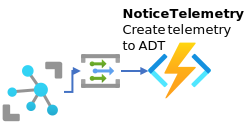
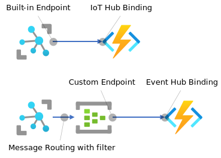

# IoT Hub から送られた Telemetry データを元に、Azure Digital Twins の Twin の Telemetry メッセージを送信する

https://docs.microsoft.com/ja-jp/azure/iot-hub/iot-hub-event-grid に記載の通り、IoT Hub が受信した Telemetry Data を Event Grid を介して、Azure Function に入力できる。  
  

Event Grid を介して送られてくる Telemetry Data を受信する Function は、[HowToBuildFunctionApps.md](./HowToBuildFunctionApp.md) で説明した形式と同一である。  
ただし、eventGridEvent の Data プロパティの値の形式は、Twin Graph の更新の形式とは異なる。  
eventGridEvent.Data からの Telemetry Data の取り出しは以下の様な形式で行う。  
```cs
        var msg = eventGridEvent.Data.ToString();
        log.LogInformation(msg);
        dynamic msgJson = Newtonsoft.Json.JsonConvert.DeserializeObject(msg);
        if (msgJson["properties"]["message-type"]!=null) {
            string telemetryMsgType = msgJson["properties"]["message-type"];
            string body = msgJson["body"];
            string telemetryMsg = System.Text.Encoding.UTF8.GetString(Convert.FromBase64String(body));
            dynamic bodyJson = Newtonsoft.Json.JsonConvert.DeserializeObject(telemetryMsg);
            double temperature = bodyJson["measurement"]["temperature"];
            string measuredtime = bodyJson["measurement"]["measuredtime"];
```

取り出したデータを元に、Azure Digital Twins の Twin Graph 上の Twin への Telemetry Data 送信や、Property の更新を行う。  

Azure IoT Hub からのデータ受信は、Azure Function の [IoT Hub Binding を使った、Built-in Endpoint からの受信](https://docs.microsoft.com/azure/azure-functions/functions-bindings-event-iot)や、[Event Hub Binding](https://docs.microsoft.com/ja-jp/azure/azure-functions/functions-bindings-event-hubs) による [Custome Endpoint](https://docs.microsoft.com/ja-jp/azure/iot-hub/iot-hub-devguide-endpoints#custom-endpoints) を使ってもよい。  

  

Device Twins の Reported Properties の更新は、Event Grid ではキャプチャできないので、Custome Endpoint（Event Hub） を利用する。  

