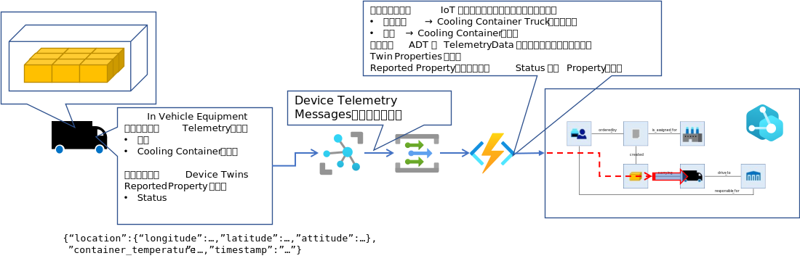

# IoT Hub から送られた Telemetry データを元に、Azure Digital Twins の Twin の Telemetry メッセージを送信する

基本的な手順は、https://docs.microsoft.com/ja-jp/azure/digital-twins/how-to-ingest-iot-hub-data に記載されているので、先ずは読んでいただきたい。  
説明の中でも記載されているが、https://docs.microsoft.com/ja-jp/azure/iot-hub/iot-hub-event-grid に記載の通り、IoT Hub が受信した Telemetry Data を Event Grid を介して、Azure Function に入力できる。  
  

Event Grid を介して送られてくる Telemetry Data を受信する Function は、[HowToBuildFunctionApps.md](./HowToBuildFunctionApp.md) で説明した形式と同一である。  
ただし、eventGridEvent の Data プロパティの値の形式は、Twin Graph の更新の形式とは異なる。  
eventGridEvent.Data からの Telemetry Data の取り出しは以下の様な形式で行う。  
```cs
        var msg = eventGridEvent.Data.ToString();
        log.LogInformation(msg);
        dynamic msgJson = Newtonsoft.Json.JsonConvert.DeserializeObject(msg);
        if (msgJson["properties"]["message-type"]!=null) {
            string telemetryMsgType = msgJson["properties"]["message-type"];
            string body = msgJson["body"];
            string telemetryMsg = System.Text.Encoding.UTF8.GetString(Convert.FromBase64String(body));
            dynamic bodyJson = Newtonsoft.Json.JsonConvert.DeserializeObject(telemetryMsg);
            double temperature = bodyJson["measurement"]["temperature"];
            string measuredtime = bodyJson["measurement"]["measuredtime"];
```

取り出したデータを元に、Azure Digital Twins の Twin Graph 上の Twin への Telemetry Data 送信や、Property の更新を行う。  

Azure IoT Hub からのデータ受信は、Azure Function の [IoT Hub Binding を使った、Built-in Endpoint からの受信](https://docs.microsoft.com/azure/azure-functions/functions-bindings-event-iot)や、[Event Hub Binding](https://docs.microsoft.com/ja-jp/azure/azure-functions/functions-bindings-event-hubs) による [Custome Endpoint](https://docs.microsoft.com/ja-jp/azure/iot-hub/iot-hub-devguide-endpoints#custom-endpoints) を使ってもよい。  

  

Device Twins の Reported Properties の更新は、Event Grid ではキャプチャできないので、Custome Endpoint（Event Hub） を利用する。  

---
## サンプル Function を使って実際に試す   
以上を踏まえて、 [Azure Digital Twins にテレメトリーデータを供給するためのシミュレータ開発](../samples/wpfapp/WpfAppProductTransportSample/WpfAppDliverTruckDriverMobileSimulator) で紹介しているサンプルアプリが Azure IoT Hub に送付するテレメトリーデータを Azure Digital Twins に入力する具体的な方法を説明する。  
サンプルアプリは、下図に示す2種類のデバイスをシミュレートしており、同一の Azure IoT Hub インスタンスにテレメトリーデータを送信する。  
<b><u>Cooling Container Truck の車載機</u></b>  
  
Simulator が送信してくるデータは、例えば、
```json
{
  "body": {
    "location": {
      "longitude": 136.898361,
      "latitude": 36.265836,
      "attitude": 1012.2
    },
    "container_temperature": -10,
    "timestamp": "2021-06-24T17:12:49.894Z"
  },
  "enqueuedTime": "2021-06-24T08:12:50.157Z",
  "properties": {
    "application": "adt-transport-sample",
    "message-type": "cctruck"
  }
}
```
であり、このデータは、対応する Cooling Container Truck（どの IoT Device から送られてきたかは、System Properties の　"iothub-connection-device-id" に Device Id が格納されているので判る） のテレメトリーとして、及び、庫内温度、親の Truck の位置情報として Twin Graph に供給される  

<b><u>Delivery Truck の運転手が持つモバイル端末アプリ</u></b>
  
Simulator が送信してくるデータは、例えば、  
```json
{
  "body": {
    "temperatureMeasurementDevices": [
      {
        "tmdId": "tmd-shi-002",
        "temperature": -9.600199068292136,
        "batteryLevel": 3.0010005395827113,
        "timestamp": "2021-06-24T17:18:21.587574+09:00"
      },
      {
        "tmdId": "tmd-shi-001",
        "temperature": -9.600199068292136,
        "batteryLevel": 3.0010005395827113,
        "timestamp": "2021-06-24T17:18:21.610972+09:00"
      }
    ],
    "location": {
      "longitude": 139.740448,
      "latitude": 35.626601,
      "attitude": 3.2
    },
    "status": 0,
    "timestamp": "2021-06-24T17:18:28.548Z"
  },
  "enqueuedTime": "2021-06-24T08:18:28.448Z",
  "properties": {
    "application": "adt-transport-sample",
    "message-type": "driver-mobile"
  }
}
```
であり、このデータは、対応する Delivery Truck の状態、及び、親の Truck の位置情報、と Temperature Measurement Device の温度、バッテリーレベルとして、Twin Graph に供給される。  
この二系統の処理は、それぞれ用の Event Subscription、Function で行ってもよいが、本コンテンツでは簡単のため、まとめて一つで行うサンプルで説明を続ける。  
  

###　Function の作成と、IoT Hub への Event Subscription の追加  
https://docs.microsoft.com/ja-jp/azure/digital-twins/how-to-ingest-iot-hub-data に詳しく書いてあるのだが、念のため、開発手順を下図に示す。  
  

#### ① Twin Graph にテレメトリーデータを発生させる Function の作成  
下図の手順に従って、Event Grid Trigger で実行する Function を作成する。  
最初の方の "Function App name" は適当な名前を付けてよい。最後の "Add function" の "New Function" は、"IoTHubTranslator" と入力すること。  
  
このステップで、Azure 上に Function が出来上がる。本体のロジックは後で、VS Code で Deploy を行う。  

追加で、Azure Digital Twins にアクセスするために、Function app の Identity を On にしておく。  
  

更に、Azure Digital Twins 側でも、作成した Function へのアクセス権を追加する。Azure Portal で Azure Digital Twins を表示し、"Access control(IAM)"を選択して設定する。    
  

#### ② Function を起動する Event Subscription を IoT Hub に追加する  
※ Docs の説明に少しだけ設定を加えるので、詳しく手順を説明する。  
IoT Hub の "Events" を選択して作業を開始する。  
途中で、"Filters" タブを選択して、  
|Key|Value|  
|-|-|  
|data.properties.application|adt-transport-sample|  

と入力している。これは、一つの Azure IoT Hub を複数の IoT ソリューションで共有する場合によく使うテクニックである。デバイスから送信されるメッセージにプロパティを付与し、どの IoT ソリューションのデバイスから送られたものかを判別する。  
※ IoT device に Tag を付与し、その値でフィルターしてもよい。  
サンプルで提供されている Simulator は、メッセージにこのプロパティを付与して送信するので、ここで作成する Event Subscription には、サンプル Simulator から送信されたメッセージのみが転送される。    

  

