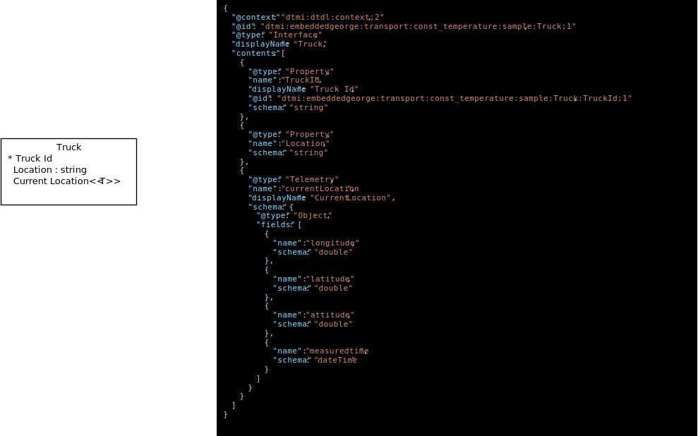
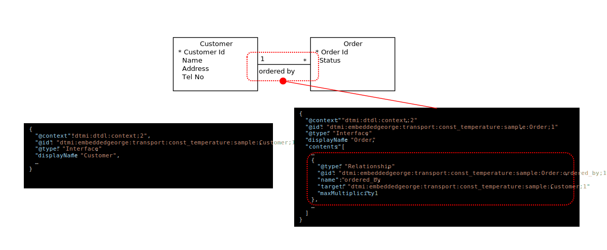
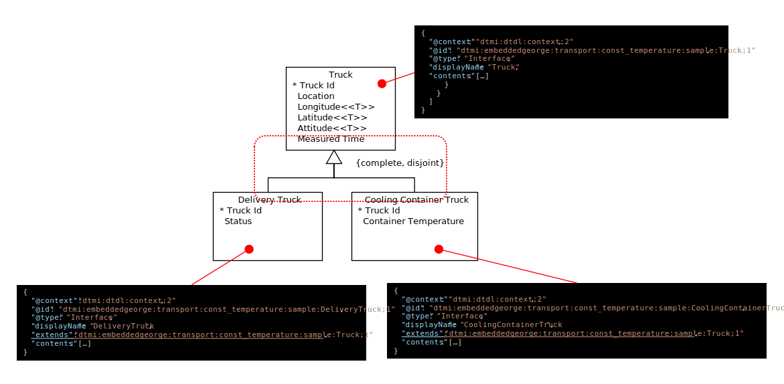

# Twin Model Graphical Notation Guide  
※ ここに記載の表記法は、マイクロソフトが推奨するものではなく、本コンテンツの作者である、太田　寛の個人的見解と個人的経験に基づいた解説であることをご留意ください。兎角文字列だけの表現は細部の確認には適しているが全体像を把握したい、概観したいといった用途には不向きであるので、そのような用途で便利だな、あるいは、趣旨にご賛同いただける場合にご利用いただければ幸いです。  

[Digital Twin Definition Language](https://github.com/Azure/opendigitaltwins-dtdl/tree/master/DTDL) で記述されるのは、"The Digital Twins Definition Language (DTDL) is a language for describing models and interfaces for IoT digital twins. Digital twins are models of entities in the physical environment such as shipping containers, rooms, factory floors, or logical entities that participate in IoT solutions." であるので、図示化するとしたら、ISO/IEC 19505 でも標準化されている、"[UML : Unified Modeling Language](https://www.uml.org/)" の表記法をベースにするのが適切であろう。  
※ ここでの表記法定義の目的はあくまでも、Digital Twins で扱う Entity 群、Relationship 群の定義のフェーズを効率化したいという事だけなので、UML の細かい仕様については、ほどほどに尊重、ほどほどに無視というスタイルをとる。  

Twin モデルは、
- Twin が持つべきプロパティセット
- Twin が生み出すテレメトリーデータセット  
- Twin が装備するコマンドセット  
- Twin と Twin の間の関連  
からなる。このような要素を図示化するのは、UML の Class Diagram を利用するのが妥当であろう。 
以下の様に DTDL の言語要素を、UML のモデリング要素に対応付ける。  

|DTDL 言語要素|UML モデル要素|
|-|-|
|Interace|クラス|
|Property|プロパティ|
|Telemetry|ステレオタイプ付プロパティ|
|Command|メソッド|
|Relationship|リレーションシップ|

---
## Interface  
例  
  
定義の全貌を俯瞰するのが目的であるので、Display Name をメインに記述している。  
"Truck Id" の左につけた "＊" は、このプロパティが論理的に一意であることを示している。  
※ DTDL の定義上、そのようなセマンティクスは無いので、まぁ、気持ちの問題のレベルであるが…  
"Current Location" の右側に付与した、"&lt;&lt;T&gt;&gt;"は、Telemetry であることを示している。  
※ UML の Stereo Type 表記を流用  
"Location : string" は、Location プロパティが string 型であることを示している。 
※ あくまでも俯瞰のための図であるので、プロパティ名だけで十分な気もするが、敢えて型を明示したい場合には、UML の表記に従いこのように表現する。  

---
## Relationship  
DTDL の場合、Relationship は、一つの Interface の定義の中で行う。二つの Interface の間を意味的に結ぶ Relationship がどちら側に定義されているかが一目でわかると便利であることを考慮して例を示す。  
  
この例では、Relationship を二つの Twin Interface を結ぶ線として記述し、両端に逆側から見た多重度を付与している。  
また、Relationship の "name" 要素の文字列を、Relationship を定義してる Twin Inteface の逆側に付与している。  
多重度を書く場所は、一般的な UML の記法に従っている。  
Relationship の "name" を書く場所は、著者の慣例であり、次の様な記述方法でもいいと思う。  
  
この記法では、Relationship の名前を線の真ん中に記載し、Relationship を定義している Twin Interface から反対側をさす矢印を追加することで、どちらに定義されているかを明示する。  

Modeling Tips  
DTDL の Relationship の多重度定義は、"minMultiplicity" と "maxMultiplicity" で、多重度の最小数、最大数が定義できるようになっている。多重度はセマンティクスの定義では非常に重要であるので、心して検討する事。  
記法上は任意の自然数を使って定義可能であるが、概念モデリング的には、以下の4種類で通常は十分である。  
|記法|意味|DTDLでの定義|
|-|-|-|
|1|Relationship でつながった Twin が必ず一つある|"maxMultiplicity": 1|
|0..1|Relationship でつながった Twin は無い場合もあるがあるとしたら一つである|"maxMultiplicity": 1|
|1..*|Relationship でつながった Twin が一つ以上ある||
|*|Relationship でつながった Twin は無いこともあるが、複数存在しうる||  

※ DTDL V2 の仕様では、minMultiplicity は 0 でなければならないようなので、シナリオ世界では必ず一つ以上の関連（"1"、"1..*"）は定義できない（多分、現状の Azure Digital Twins に Transaction 的な機能が欠けているからだろう）。がしかし、重ねて言うが、多重度は概念モデリングにおいては非常に重要であるので、DTDL で定義できなくてもモデリングの最中には、在りうるシナリオについて、最小が0なのか1なのかを吟味する事。  

---
## Extends  
DTDL の extends は、UML の Substitution で表現するのが妥当と思われるので、

で、表現する。  
extends を表す、△ と線の横に書いてある、{"complete","disjoint"} は、親（△側）の Twin Interface をひな型にした Twin がある場合、その Twin は、複数の子（線側）の Twin Interface をひな型にした Twin が必ず1つだけ存在する（disjoint)事を意味し、かつ、図に書かれた子の Twin Interface のどれかである(complete) 事を注記している。  
※ まぁ、ここまで凝らなくても表現上は十分であるが、著者に長年染みついた書き方なのでご容赦願いたい。  

---

## 付記  
以上、ざっと紹介してみた。ここで紹介した Notiation はあくまでも、Twin Model を作成する際のモデリングの過程で見通しを良くする、あるいは、Twin Model 定義後の開発フェーズで開発者が概要を把握しやすいようにすることを目的としている。絵を描いて、DTDL が自動生成されるわけでもないので、図示化は本来の目的の範疇でほどほどのレベルで描くことを推奨する。  
